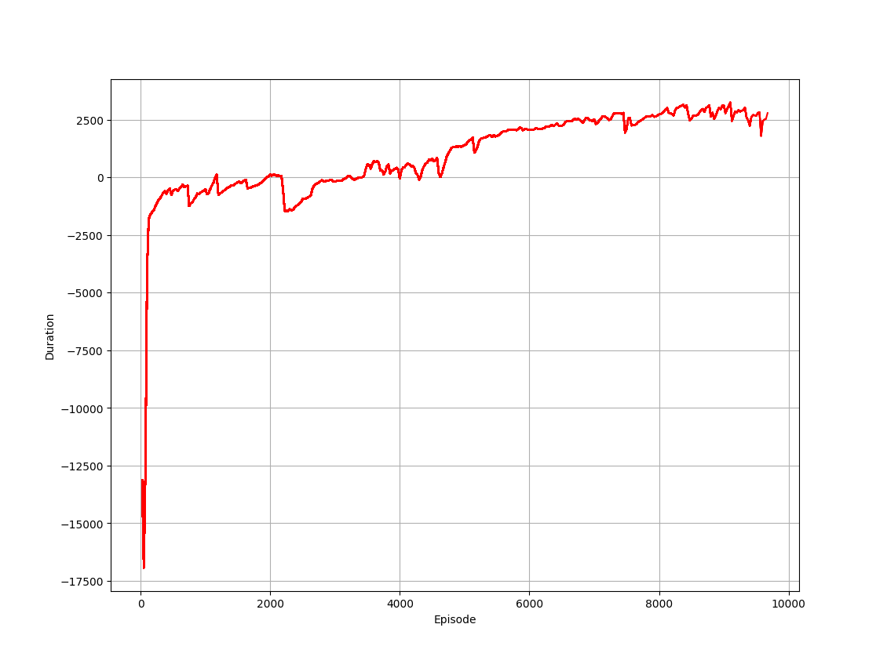
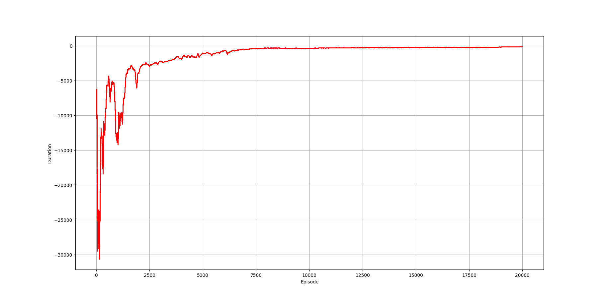
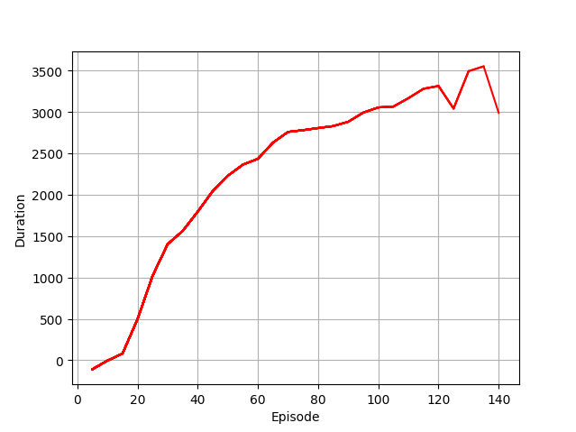
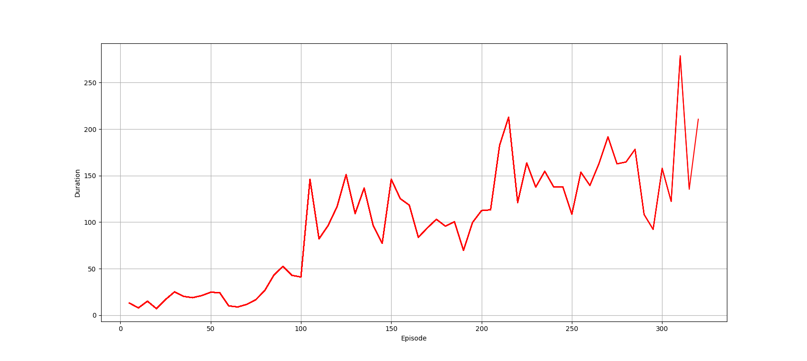

# reinforcement_learning_tutorial


- A repository for studing reinforcement learning.
- All algorithm descriptions are available at the following [link](./Summary/AlgorithmSummary.md).
- All concept descriptions are available at the following [link](./Summary/ConceptSummary.md).
- Discontinous output tutorial: [Cartpole Tutorial](#3-cartpole-tutorial).
- Continous output tutorial: [Atari Tutorial](#4-atari-tutorial).

# Table of Contents

1. [Setup](#1-setup)
2. [Before Start](#2-before-start)
    1. [Check environments](#1-check-environments)
    2. [Simple policy](#2-simple-policy)
3. [Cartpole Tutorial](#3-cartpole-tutorial)
    1. [Q-learning](#1-q-learning)
    2. [DQN](#2-dqn)
    3. [REINFORCE](#3-reinforce)
    4. [Actor Critic](#4-actor-critic)
    5. [A2C](#5-a2c)
    6. [PPO](#6-ppo)
    7. [#TODO SAC](#7-sac)
4. [Continous Action Tutorial](#4-continous-action-tutorial)
    1. [PPO](#1-ppo)
    2. [#TODO SAC](#2-sac)

## 1. Setup

1. **Download tutorial code**
   ```bash
   mkdir ~/reinforcement_learning_tutorial
   git clone https://github.com/HJS-HJS/reinforcement_learning_tutorial.git reinforcement_learning_tutorial
   ```

2. **Install required python library**
   ```bash
   cd ~/reinforcement_learning_tutorial
   pip3 install -r requirements.txt
   ```

## 2. Before Start
### 1. Check environments
- Check if CUDA is properly installed
    ```bash
    python3 ~/reinforcement_learning_tutorial/before_start_1_1_check_cuda.py
    ```
- Check if cartpole is running
    ```bash
    python3 ~/reinforcement_learning_tutorial/before_start_1_2_start_gym.py
    ```

### 2. Simple policy
- An example of moving a cartpole with an unchanging policy.
    ```bash
    python3 ~/reinforcement_learning_tutorial/before_start_2_start_policy.py
    ```

## 3. Cartpole Tutorial
- The output of the reinforcement learning model is two discrete values, left and right.
### 1. Q-learning
- Reinforcement learning wth Q table
    ```bash
    python3 ~/reinforcement_learning_tutorial/tutorial_1_1_q_learning.py
    ```
- Reinforcement learning wth Q-learning (with epsilon greedy)
    ```bash
    python3 ~/reinforcement_learning_tutorial/tutorial_1_2_q_learning_greedy.py
    ```

### 2. DQN
- Reinforcement learning wth DQN
    ```bash
    python3 ~/reinforcement_learning_tutorial/tutorial_2_dqn.py
    ```
- paper
    - [Playing Atari with Deep Reinforcement Learning (2013)](https://arxiv.org/pdf/1312.5602)
    - [Human-level control through deep reinforcement learning (2015)](https://www.nature.com/articles/nature14236)

### 3. REINFORCE
- Reinforcement learning wth REINFORCE
    ```bash
    python3 ~/reinforcement_learning_tutorial/tutorial_3_REINFORCE.py
    ```

### 4. Actor Critic
- Reinforcement learning wth actor critic
    ```bash
    python3 ~/reinforcement_learning_tutorial/tutorial_4_1_actor_critic.py
    ```
- Reinforcement learning wth actor critic (Actor and critic share network)
    ```bash
    python3 ~/reinforcement_learning_tutorial/tutorial_4_2_actor_critic.py
    ```

### 5. A2C
- Reinforcement learning wth A2C (Advantage Actior Critic)
    ```bash
    python3 ~/reinforcement_learning_tutorial/tutorial_5_A2C.py
    ```

### 6. PPO
- Reinforcement learning wth PPO (Proximal Policy Optimization)
    ```bash
    python3 ~/reinforcement_learning_tutorial/tutorial_6_1_PPO.py
    ```
- Reinforcement learning wth PPO (Actor and critic share network)
    ```bash
    python3 ~/reinforcement_learning_tutorial/tutorial_6_1_PPO_share.py
    ```
- paper
    - [Proximal Policy Optimization Algorithms (2017)](https://arxiv.org/pdf/1707.06347)

## 4. Continous Action Tutorial
- The output of the reinforcement learning model is continous values.

### 1. PPO
- Reinforcement learning wth MUJOCO half cheetah.
- Continous action, fully connected linear neural network.
    ```bash
    python3 ~/reinforcement_learning_tutorial/tutorial_continuos_1_1_PPO.py
    ```
    <div align="center">
        
    </div>
- Reinforcement learning wth MUJOCO half cheetah.
- Continous action, fully connected linear neural network.
- Actor and Critic share layers.
- Not learned well.
    ```bash
    python3 ~/reinforcement_learning_tutorial/tutorial_continuos_1_2_PPO.py
    ```
    <div align="center">
        
    </div>

### 2. SAC 2019
- Reinforcement learning wth SAC 2019 (Soft Actor Critic)
- MUJOCO half cheetah.
    ```bash
    python3 ~/reinforcement_learning_tutorial/tutorial_continuos_2_1_SAC.py
    ```
    <div align="center">
        
    </div>
- car racing.
    - Use CNN
    ```bash
    python3 ~/reinforcement_learning_tutorial/tutorial_continuos_2_2_SAC.py
    ```
    <div align="center">
        
    </div>

- paper
    - [Soft Actor-Critic: Off-Policy Maximum Entropy Deep Reinforcement Learning with a Stochastic Actor (2018)](https://arxiv.org/abs/1801.01290)
    - [Soft Actor-Critic Algorithms and Applications (2019)](https://arxiv.org/abs/1812.05905)
