# Reinforcement Learning Algorithm Summary

# Table of Contents
0. [Basic information](#0-basic-information)
1. [Bellman equation](#1-bellman-equation)
2. [Purpose of RL](#2-purpose-of-rl)
3. [Value Iteration](#3-value-iteration)
4. [Q-Learning](#4-q-learning)
5. [Fitted Value Iteration](#5-fitted-value-iteration)
6. [DQN](#6-dqn)
7. [Policy Gradient](#7-policy-gradient)
8. [REINFORCE](#8-reinforce)
9. [Actor Critic](#9-actor-critic)
10. [A2C](#10-a2c)
11. [PPO](#11-ppo)
12. [Policy Iteration](#12-policy-iteration)
13. [SAC](#13-sac)

## 0. Basic information
- Return
    - $G_t=R_t+\gamma R_{t+1}+\gamma ^2R_{t+2}+\dots $
- Expected return
    - $E[G_t]=\int_x G_tP(x)dx $
- State Value Function
    - Total reward from $s_t$.
    - $V(s_t)≜\int_{a_t:a_\infty}G_tP(a_t,s_{t+1},a_{t+1},\dots \mid s_t)da_t:a_\infty $
    - $V(s_t)=\mathbb{E}_{a_t \sim p(a_t \mid s_t)}[Q(s_t,a_t)]$
- Action State Value Function
    - Total reward from taking $a_t$ in $s_t$.
    - $Q(s_t, a_t)≜\int_{s_{t+1}:a_\infty}G_tP(s_{t+1},a_{t+1},s_{t+2}\dots \mid s_t,a_t)ds_{t+1}:a_\infty $
    - $Q(s_t, a_t)=\mathbb{E}_{s_t, a_t \sim p(s_t, a_t)}[G_t \mid s_t,a_t]$

- On Policy: Behavior Policy $=$ Target Policy
- Off Policy: Behavior Policy $\neq$ Target Policy
- On Line
    - Agents interact with their environment in real time, collecting data and using this data to update policies.
- Off Line
    - Learns only from a fixed dataset collected in advance, and does not interact with the environment during learning.

|         | On Policy       | Off Policy     |
|---------|-----------------|----------------|
| On-Line | Q-Learning REINFORCE Actor-Critic A2C PPO | DQN SAC |
| Off-Line| - | - |

## 1. Bellman equation
- State Value Function $\quad V \rightarrow Q$

    

<!-- $$\begin{align*}
V(s_t) &\triangleq \int_{a_t:a_\infty}G_tP(a_t,s_{t+1},a_{t+1},\dots \mid s_t)da_t:a_\infty \\
&=\int_{a_t}\int_{s_{t+1}:a_\infty}G_tP(s_{t+1},a_{t+1},\dots \mid s_t,a_t)ds_{t+1}:a_\infty P(a_t \mid s_t)da_t \\
&=\int_{a_t}Q(s_t,a_t) P(a_t \mid s_t)da_t
\end{align*}$$ -->

- State Value Function $\quad V(s_t) \rightarrow v(s_{t+1})$

    

<!-- $$\begin{align*}
V(s_t) &\triangleq \int_{a_t:a_\infty}G_tP(a_t,s_{t+1},a_{t+1},\dots \mid s_t)da_t:a_\infty \\
&=\int_{a_t:s_{t+1}}\int_{a_{t+1}:a_\infty}(R_t+\gamma G_{t+1})P(a_{t+1},\dots \mid s_t,a_t,s_{t+1})da_{t+1}:a_\infty P(a_t,s_{t+1} \mid s_t)da_t:s_{t+1} \\
&=\int_{a_t:s_{t+1}}(R_t+\gamma V(s_{t+1}))P(a_ts_{t+1} \mid s_t)da_t:s_{t+1}
\end{align*}$$ -->

- Action State Value Function $\quad Q \rightarrow V$

    

<!-- $$\begin{align*}
Q(s_t, a_t) &\triangleq \int_{s_{t+1}:a_\infty}G_t P(s_{t+1},a_{t+1},s_{t+2}\dots \mid s_t,a_t) ds_{t+1}:a_\infty \\
&= \int_{s_{t+1}} \int_{a_{t+1}:a_\infty} \big( R_t + \gamma G_{t+1} \big) P(a_{t+1} s_{t+2} \dots \mid s_t, a_t, s_{t+1}) da_{t+1}:a_\infty P(s_{t+1} \mid s_t, a_t) ds_{t+1} \\
&= \int_{s_{t+1}} \big( R_t + V(s_{t+1}) \big) P(s_{t+1} \mid s_t, a_t) ds_{t+1} 
\end{align*}$$ -->
    

- Action State Value Function $\quad Q(s_t,a_t) \rightarrow Q(s_{t+1},a_{t+1})$

    

<!-- $$\begin{align*}
Q(s_t, a_t) &\triangleq \int_{s_{t+1}:a_\infty}G_t P(s_{t+1},a_{t+1},s_{t+2}\dots \mid s_t,a_t) ds_{t+1}:a_\infty \\
&= \int_{s_{t+1} a_{t+1}} \int_{s_{t+2}:a_\infty} \big( R_t + \gamma G_{t+1} \big) P(s_{t+2} \dots \mid s_t, a_t, s_{t+1}, a_{t+1}) ds_{t+2}:a_\infty P(s_{t+1}, a_{t+1} \mid s_t, a_t) ds_{t+1} a_{t+1} \\
&= \int_{s_{t+1} a_{t+1}} \big( R_t + \gamma Q(s_{t+1}, a_{t+1}) \big) P(s_{t+1}, a_{t+1} \mid s_t, a_t) ds_{t+1} da_{t+1} \\
&= \int_{s_{t+1} a_{t+1}} \big( R_t + \gamma Q(s_{t+1}, a_{t+1}) \big) P(s_{t+1} \mid s_t, a_t) P(a_{t+1} \mid s_{t+1}) ds_{t+1} a_{t+1}
\end{align*}$$ -->

## 2. Purpose of RL
- optimal policy $Q^*$
    - $Q^*(s_t,a_t)=\underset{\pi}{\mathrm{max}}\mathbb{E}[r_t + \gamma^{} r_{t+1} + \gamma^{2} r_{t+2} + \dots \mid s_t, a_t, \pi]$
    - $a_{t}^* \triangleq \underset{a_t}{\mathrm{argmax}} Q^*(s_t,a_t)$
- maximize expected return $V(s_t)$

    

<!-- $$\begin{align*}
\mathrm{argmax} V(s_t) &= \mathrm{argmax} \int_{a_t} Q(s_t,a_t) P(a_t \mid s_t)da_t \\
&= \mathrm{argmax} \int_{a_t}Q^*(s_t,a_t) P(a_t \mid s_t)da_t
\end{align*}$$ -->

## 3. Value Iteration
- Value Iterarion:
    - Method to solve MDP as dynamic programming.
    - The following equation is repeated to find the optimal function.
        

        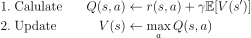
        

        <!-- $$\begin{align*}
        &\mathrm{1. \ Calulate} \quad &Q(s,a) &\leftarrow r(s,a) + \gamma \mathbb{E} [V(s')] \\
        &\mathrm{2. \ Update} \quad &V(s) &\leftarrow \max_a Q(s,a)
        \end{align*}$$ -->
- Proof convergence of value iteration:
    - Use Bellman operatior $BV=\max_a [r_a + \gamma \mathcal{T}_a V]$
    - Bellman operatior $B$ is contraction w.r.t $\infty$-norm (max norm)
        - which mean $\lVert BV - B\bar{V} \rVert _{\infty} \le \gamma \lVert V - \bar{V} \rVert _{\infty}$
    - If $\hat{V} = V^{\ast}$, then $\lVert BV - V^{\ast} \rVert _{\infty} \le \gamma \lVert V - V^{\ast} \rVert _{\infty}$
    - $V$ converge to $V^*$

- Suppose policy as Dirac delta function
    - The policy is not used directly, but is included in the value function, etc.
    - $P^* (a_t \mid s_t) = \delta (a_t - a_t^*)$
- Then how can we get $Q^*$?
    1. Monte Carlo (MC)
        - Update every episode.
        - Unbiased, higher variance.
    

    
    

    <!-- $$\begin{align*}
    Q(s_t, a_t) \approx \frac{1}{N} \sum_{i=1}^NG_t^{(i)}
    \end{align*}$$ -->

    2. Temporal Difference (TD)
        - learning rate $=\alpha$
        - TD Error $= R_t^N+\gamma Q(s_{t+1}^N, a_{t+1}^N) - \bar{Q}_{N-1}$
        - TD Target $= R_t^N+\gamma Q(s_{t+1}^N, a_{t+1}^N)$
        - Update every step.
        - Biased, lower variance.
    

    
    

    <!-- $$\begin{align*}
    Q(s_t, a_t) &\approx \frac{1}{N} \sum_{i=1}^N (R_t^N + \gamma Q(s_{t+1}^N, a_{t+1}^N)) \triangleq \bar{Q}_{N} \\
    &= \frac{1}{N} ((N-1) \bar{Q}_{N-1} + R_t^N + \gamma Q(s_{t+1}^N, a_{t+1}^N)) \\
    &= \bar{Q}_{N-1} + \frac{1}{N} (R_t^N+ \gamma Q(s_{t+1}^N, a_{t+1}^N) - \bar{Q}_{N-1}) \\
    \therefore \bar{Q}_{N} &= (1- \alpha ) \bar{Q}_{N-1} + \alpha (R_t^N + \gamma Q(s_{t+1}^N, a_{t+1}^N)) \\
    \end{align*}$$ -->

## 4. Q-Learning
- Target: $P(a_{t+1} \mid s_{t+1}) = \delta(a_{t+1} - a_{t+1}^*) $
- Behavior: $\epsilon$-greedy
    - You can also use Bolzmann exploration

    

<!-- $$\begin{align*}
Q(s_t, a_t) &= \int_{s_{t+1} a_{t+1}} \big( R_t + \gamma Q(s_{t+1}, a_{t+1}) \big) P(s_{t+1} \mid s_t, a_t) P(a_{t+1} \mid s_{t+1}) ds_{t+1} a_{t+1} \\
&= \int_{s_{t+1} a_{t+1}} \big( R_t + \gamma Q(s_{t+1}, a_{t+1}) \big) P(s_{t+1} \mid s_t, a_t) \delta(a_{t+1} - a_{t+1}^*) ds_{t+1} a_{t+1} \\
&= \int_{s_{t+1}} \big( R_t + \gamma Q(s_{t+1}, a_{t+1}^*) \big) P(s_{t+1} \mid s_t, a_t) ds_{t+1} \\
&= \int_{s_{t+1}} \big( R_t + \gamma \max _{a_{t+1}} Q(s_{t+1}, a_{t+1}) \big) P(s_{t+1} \mid s_t, a_t) ds_{t+1} \\
&= \frac{1}{N}\sum_{i=1}^N ( R_t^N + \gamma \max _{a_{t+1}} Q(s_{t+1}, a_{t+1}) \big) \\
Q^*(s, a) &= \mathbb{E}_{s' \sim \epsilon } [r + \gamma \max _{a'} Q^*(s', a') \mid s, a] \qquad Q_i \rightarrow Q^*  \ when \ i \rightarrow \infty \\
\end{align*}$$ -->

- Update

    

<!-- $$\begin{align*}
\bar{Q}_{N} \leftarrow (1- \alpha ) \bar{Q}_{N-1} + \alpha (R_t^N + \gamma \max _{a_{t+1}} Q(s_{t+1}^N, a_{t+1}^N) \big )
\end{align*}$$ -->

## 5. Fitted Value Iteration
- Learn value function by using neural network
- The following equation is repeated to find the optimal function.
    

    
    

    <!-- $$\begin{align*}
    &\mathrm{1. \ Calulate} \quad &y_i &\leftarrow \max_{a_i} (r(s_i,a_i)+\gamma \mathbb{E}[V_\theta(s_i')]) \\
    &\mathrm{2. \ Update} \quad &\theta &\leftarrow {\mathrm{argmin}}_{\theta} \frac{1}{2} \sum _i \lVert V_{\theta} (s_i) - y_i \rVert ^2 \\
    \end{align*}$$ -->

- Proof convergence of value iteration:
    - $y_i = V'(s_i) = (BV)(s_i)$
    - $V' \leftarrow \mathrm{argmin} _{V' \in \Omega} \frac{1}{2} \lVert V' (s) - y_i \rVert ^2 = \mathrm{argmin} _{V' \in \Omega} \frac{1}{2} \lVert V'(s) - (BV)(s_i) \rVert ^2$
    - $\Omega$ means the value function space of neaural network. And can be expressed as follows.
        - $\Pi V = {\mathrm{argmin}}_{V' \in \Omega} \frac{1}{2} \lVert V' (s) - V \rVert ^2$
    - $V \leftarrow \Pi B V$
    - Operatior $\Pi$ is contraction w.r.t 2-norm (Euclidian norm)
        - which mean $\lVert \Pi V - \Pi \bar{V} \rVert ^2 \le \lVert V - \bar{V} \rVert ^2$
    - $\Pi$ and $ B$ are both contraction.
    - However, $\Pi B$ is Not contraction.
    - This means that fitted value iteration may not converge.

## 6. DQN
- The Q value reflects more states through regression (Neural Network).
    - [Playing Atari with Deep Reinforcement Learning (2013)](https://arxiv.org/pdf/1312.5602)
    - [Human-level control through deep reinforcement learning (2015)](https://www.nature.com/articles/nature14236)
- The number of outputs generated is the number of possible combinations of actions.
- Features:
    1. Using neural network (Q-Network) (CNN to act like humans)
    2. Use Experience replay.
        - Problem:
            - The states obtained during learning are sequential and highly correlated.
            - Therefore, similar information cannot be obtained continuously.
            - This violates the iid(Identically Distributed) assumption and interferes with learning.
        - Solution:
            - Save the state at replay buffer
            - Randomly select the state at buffer and learning as mini batch
        - Effect:
            - Solve correlated sample problem
            - Thanks to batch, can get low variance gradient while learning 
    3. Seperate target, main network
        - Problem:
            - Although the y value changes as learning progresses, learning is done with the goal of finding a Q value(target network) that fits y.
            - This causes a __convergence, stability problem__ because it tries to converge on the continuously changing y value.
            - So we need to prevent the target network from ossilating, during regression.
        - Solution:
            - Fix the target network parameters used for the target value for a certain learning period.
- Additional technic not in classic DQN:
    - After n steps, the updated $\theta'$ may have lagging(differences) from the previous $\theta$.
    - To solve this, Polyak averaging, etc. can be used (normally $\tau$=0.99).
    - $\theta' \leftarrow \tau \theta' + (1 - \tau)\theta$
- Action State Value $Q$ is same as Q-Learing:
- Loss function $L_i(\theta _i)$ of Q-Network:

  

<!-- $$\begin{align*}
L_i(\theta _i) &=  \mathbb{E}_{s,a \sim p(\cdot) } [y_i - Q(s , a ; \theta _i)] \\
y_i &= \mathbb{E}_{s' \sim \epsilon } [r + \gamma \max _{a'} Q(s', a' ; \theta _{i-1}) \mid s, a] \\
{\triangledown}_{\theta _i} L_i(\theta _i) &= \mathbb{E}_{s,a \sim p(\cdot) ; s' \sim \epsilon} [(r + \gamma \max _{a'} Q(s', a' ; \theta _{i-1})-Q(s,a;\theta_i)){\triangledown}_{\theta _i} Q(s , a ; \theta_i )] \\
\end{align*}$$ -->

## 7. Policy Gradient
- Policy Gradient:
    - __Soft__ update the policy via gradient (Soft version of policy iteration)
    - The following equation is repeated to find the optimal function.
        

        
        

        <!-- $$\begin{align*}
        &\mathrm{0. \ Evaluate \ (exmaple)} \quad &A(s_i,a_i) &= r(s_i, a_i) + V(s'_i) - V(s_i)\\
        &\mathrm{1. \ Calulate \ Objective} &{\triangledown}_{\theta}J &\approx \sum_i {\triangledown}_{\theta} \log{P_\theta(a_i \mid s_i)} Q(s_i, a_i) \\
        &\mathrm{2. \ Update} \quad &\theta &\leftarrow \theta + \alpha {\triangledown}_{\theta}J(\theta)
        \end{align*}$$ -->

- Get policy as PDF
    - $P^* (a_t \mid s_t) = PDF$
- Strengths in continuous action.
- Can create stochastic policies.
- Object function $J$ 
    - Purpose of object function is maximize expected return G
    - Trajectory: $\tau = {s_0, a_0, s_1, \dots}$

  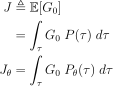

<!-- $$\begin{align*}
J &\triangleq \mathbb{E}[G_0] \\
&=\int_\tau G_0 \ P(\tau) \ d\tau \\
J_\theta&=\int_\tau G_0 \ P_\theta(\tau) \ d\tau \\
\end{align*}$$ -->

- Possibility can devided into transision and policy

  

<!-- $$\begin{align*}
{P_\theta(\tau)} &= {P_\theta(s_0, a_0, s_1, \dots)} \\
&= P(s_0)P_\theta(a_0, s_1, \dots \mid s_0) \\
&= P(s_0)P_\theta(a_0 \mid s_0)P_\theta(a_0, s_1, \dots \mid s_0, a_0) \\
&= P(s_0)P_\theta(a_0 \mid s_0)P(s_1 \mid s_0,a_0) P_\theta(a_ 1\mid s_0,a_0,s_1) \dots \\
&= P(s_0)P_\theta(a_0 \mid s_0)P(s_1 \mid s_0,a_0) P_\theta(a_ 1\mid s_0) \dots \\
&= transision \times policy \times transision \times policy \times \dots \\
{\triangledown}_{\theta} \ln{P_\theta(\tau)} &= \sum_{t=0}^{\infty}{{\triangledown}_{\theta} \ln{P_\theta (a_t \mid s_t)} }\\
\end{align*}$$ -->

- When i > k,

  

<!-- $$\begin{align*}
P_\theta(\tau) &= P_\theta(a_i \mid \tau_{-a_i})P(\tau_{-a_i}) \\
&= P_\theta(a_i \mid s_i)P(\tau_{-a_i}) \\
\int_\tau R_k {\triangledown}_{\theta} \ln{P_\theta (a_i \mid s_i)} \ P_\theta(\tau)d\tau &= \int_\tau R_k {\triangledown}_{\theta} \ln{P_\theta (a_i \mid s_i)} \ P_\theta(a_i \mid s_i)P(\tau_{-a_i}) d\tau \\
&= \int_{\tau_{-a_i}} R_k \int_{a_i} {\triangledown}_{\theta} \ln{P_\theta (a_i \mid s_i)} \ P_\theta(a_i \mid s_i)da_i P(\tau_{-a_i})d\tau_{-a_i} \\
&= \int_{\tau_{-a_i}} R_k \int_{a_i} {\triangledown}_{\theta} P_\theta(a_i \mid s_i)da_i P(\tau_{-a_i})d\tau_{-a_i} \\
&= \int_{\tau_{-a_i}} R_k {\triangledown}_{\theta} \int_{a_i} P_\theta(a_i \mid s_i)da_i P(\tau_{-a_i})d\tau_{-a_i} \\
&= \int_{\tau_{-a_i}} R_k {\triangledown}_{\theta} P(\tau_{-a_i})d\tau_{-a_i} \\
&= 0 \\
\end{align*}$$ -->

- use policy gradient $\triangledown_\theta J_\theta$ to update network

  

<!-- $$\begin{align*}
\theta \leftarrow \theta + \alpha{\triangledown}_{\theta} J_\theta
\end{align*}$$ -->

  

<!-- $$\begin{align*}
{\triangledown}_{\theta} J_\theta &\triangleq \frac{\partial J_\theta}{\partial \theta} \\
&={\triangledown}_{\theta}\int_\tau G_0 \ P_\theta(\tau)d\tau \\
&=\int_\tau G_0 \ {\triangledown}_{\theta} \ P_\theta(\tau)d\tau \\
&=\int_\tau G_0 \ {\triangledown}_{\theta} \ \ln{P_\theta(\tau)} \ P_\theta(\tau)d\tau \\
&=\int_\tau (R_0 + \gamma R_1 + \gamma^2 R_2 \dots) \ ({\triangledown}_{\theta} \ln{P_\theta (a_0 \mid s_0)} + {\triangledown}_{\theta} \ln{P_\theta (a_1 \mid s_1)}+\dots) \ P_\theta(\tau)d\tau \\
&=\int_\tau \sum_{t=0}^{\infty} \ ({\triangledown}_{\theta} \ln{P_\theta (a_t \mid s_t)} \times (\sum_{k=t}^{\infty}{\gamma ^k R_k}) ) \ P_\theta(\tau)d\tau \\
&=\int_\tau \sum_{t=0}^{\infty} \ ({\triangledown}_{\theta} \ln{P_\theta (a_t \mid s_t)} \times (\sum_{k=t}^{\infty}{\gamma ^t \gamma ^{k-t} R_k}) ) \ P_\theta(\tau)d\tau \\
&=\int_\tau \sum_{t=0}^{\infty} \ ({\triangledown}_{\theta} \ln{P_\theta (a_t \mid s_t)} \times ({\gamma ^t G_t}) ) \ P_\theta(\tau)d\tau \\
&\approx \int_\tau \sum_{t=0}^{\infty} \ ({\triangledown}_{\theta} \ln{P_\theta (a_t \mid s_t)} \times G_t ) \ P_\theta(\tau)d\tau \\
\end{align*}$$ -->

- when $t \rightarrow \infty , {\gamma ^t G_t} \approx {G_t}$
    - __Biased__ cause by this approximation

## 8. REINFORCE
- Policy gradient $\triangledown_\theta J_\theta$. Suppose N as 1

  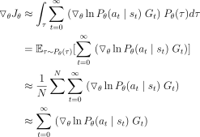

<!-- $$\begin{align*}
{\triangledown}_{\theta} J_\theta &\approx \int_\tau \sum_{t=0}^{\infty} \ ({\triangledown}_{\theta} \ln{P_\theta (a_t \mid s_t)} \ G_t ) \ P_\theta(\tau)d\tau \\
&= \mathbb{E}_{\tau \sim P_\theta(\tau)} [ \sum_{t=0}^{\infty} \ ({\triangledown}_{\theta} \ln{P_\theta (a_t \mid s_t)} \ G_t )] \\
&\approx \frac{1}{N}\sum_{}^{N} \sum_{t=0}^{\infty} \ ({\triangledown}_{\theta} \ln{P_\theta (a_t \mid s_t)} \ G_t ) \\
&\approx \sum_{t=0}^{\infty} \ ({\triangledown}_{\theta} \ln{P_\theta (a_t \mid s_t)} \ G_t ) \\
\end{align*}$$ -->

- Update
    - You can only update once an episode is finished because you can get $G_t$ only after the episode is finished.

  

<!-- $$\begin{align*}
\theta &\leftarrow \theta + \alpha {\triangledown}_{\theta} J_\theta\\
&\leftarrow \theta + \alpha \sum_{t=0}^{\infty} \ {\triangledown}_{\theta} \ln{P_\theta (a_t \mid s_t)} \ G_t \\
\end{align*}$$ -->

- Unbiased, but very high variance because all paths and possibilities have to be experienced.
- The policy gradient implies:
    - Aim for good samples and avoid bad samples. 
    - Trial and error is formalized as policy gradient.
- Markov property is not used.
    - Can be used for partially observed MDP without modification.

## 9. Actor Critic
- Use both value based method(Critic) and policy based method(Actor)
- Update every step like TD in value based method
- Biased, low variance
    - Biased caused by approximation of $t \rightarrow \infty , {\gamma ^t G_t} \approx {G_t}$ in index 6
    - Biased caused by ignore the $\sum_{t=0}^{\infty}$
- Actor update policy $P_\theta (a_t \mid s_t)$
- Critic update $Q_w$
- Policy gradient $\triangledown_\theta J_\theta$ for update actor network
    - Use marginalize $\int_{x} P(x,y)dx = P(y)$
    

        
    

<!-- $$\begin{align*}
{\triangledown}_{\theta} J_\theta &\approx \int_\tau \sum_{t=0}^{\infty} \ {\triangledown}_{\theta} \ln{P_\theta (a_t \mid s_t)} G_t \ P_\theta(\tau)d\tau \\
&= \sum_{t=0}^{\infty} \int_\tau \ {\triangledown}_{\theta} \ln{P_\theta (a_t \mid s_t)} G_t \ P_\theta(\tau)d\tau \\
&= \sum_{t=0}^{\infty} \int_{s_0,a_0,\dots s_t,a_t} \ {\triangledown}_{\theta} \ln{P_\theta (a_t \mid s_t)} \int_{s_{t+1}, a_{t+1}, \dots} G_t \ P_\theta(s_{t+1}, a_{t+1}, \dots \mid s_t,a_t)ds_{t+1}, a_{t+1}, \dots P(s_0,a_0,\dots ,s_t,a_t) ds_0, a_0, \dots ,s_t,a_t\\
&= \sum_{t=0}^{\infty} \int_{s_0,a_0,\dots s_t,a_t} \ {\triangledown}_{\theta} \ln{P_\theta (a_t \mid s_t)} Q(s_t, a_t) P(s_0,a_0,\dots ,s_t,a_t) ds_0, a_0, \dots ,s_t,a_t \\
&= \sum_{t=0}^{\infty} \int_{s_t,a_t} \ {\triangledown}_{\theta} \ln{P_\theta (a_t \mid s_t)} Q(s_t, a_t) P(s_t,a_t) ds_t, a_t  \qquad \qquad (marginalize)\\
&\approx \mathbb{E}_{s_t, a_t \sim P}[{\triangledown}_{\theta} \ln{P_\theta (a_t \mid s_t)} Q(s_t, a_t)] \qquad \qquad \qquad \qquad \qquad \; (ignore \sum_{t=0}^{\infty})\\
\end{align*}$$ -->

- Loss function $L_i(w_i)$ for critic network
    - Note that $y$ is treated as a constant and is not used in learning.
    - To prevent ossilating during learning.

- Update
    - You can update for every step.
    - When critic is updated, $R_t + \gamma Q_w(s_{t+1}, a_{t+1})$ should be treated as __constant__
    

        
    

<!-- $$\begin{align*}
Actor \quad
\theta &\leftarrow \theta + \alpha {\triangledown}_{\theta} J_\theta\\
&\leftarrow \theta + \alpha {\triangledown}_{\theta} \ln{P_\theta (a_t \mid s_t)} Q(s_t, a_t) \\
Critic \quad
w &\leftarrow w + \beta {\triangledown}_{w} L_w\\
&\leftarrow w + \beta (R_t + \gamma Q_w(s_{t+1}, a_{t+1})-Q_w(s_t,a_t)){\triangledown}_{w_i} Q_w(s_t , a_t )\\
\end{align*}$$ -->

## 10. A2C
- Lower sample variance by using advantage $A=Q(s_t,a_t) - V(s_t)$
- Biased, low variance
    - Biased caused by approximation of $t \rightarrow \infty , {\gamma ^t G_t} \approx {G_t}$ in index 6
    - Biased caused by only using N samples to learn, not the whole data $(\sum_{t=0}^{\infty})$
    - Biased caused by the fact that $V_w$ used to get sample is different with real $V^*$

- Update every N steps as batch

- If you use Advantage $A=Q-V$, the variance is reduced. __(Need to study later)__

- If we replace Q with V in policy gradient, we get:
    

        
    

<!-- $$\begin{align*}
\sum_{t=0}^{\infty} \int_{s_t,a_t} \ {\triangledown}_{\theta} \ln{P_\theta (a_t \mid s_t)} V(s_t) P(s_t,a_t) ds_t, a_t &= \sum_{t=0}^{\infty} \int_{s_t,a_t} \ {\triangledown}_{\theta} \ln{P_\theta (a_t \mid s_t)} V(s_t) P_\theta(a_t\mid s_t) \ P(s_t) ds_t, a_t \\
&= \sum_{t=0}^{\infty} \int_{s_t,a_t} \ {\triangledown}_{\theta} P_\theta (a_t \mid s_t) V(s_t) \ P(s_t) ds_t, a_t \\
&= \sum_{t=0}^{\infty} \int_{s_t} {\triangledown}_{\theta} \int_{a_t} \ P_\theta (a_t \mid s_t) da_t V(s_t) \ P(s_t) ds_t \\
&=0 \\
\end{align*}$$ -->

- You can rewrite the advantage as follows:
    

        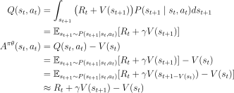
    

<!-- $$\begin{align*}
Q(s_t, a_t) &= \int_{s_{t+1}} \big( R_t + V(s_{t+1}) \big) P(s_{t+1} \mid s_t, a_t) ds_{t+1}  \\
&= \mathbb{E}_{s_{t+1} \sim P(s_{t+1} \mid s_t, a_t)} [R_t + \gamma V(s_{t+1})]\\
A^{\pi \theta}(s_t, a_t) &= Q(s_t, a_t) - V(s_t)\\
&= \mathbb{E}_{s_{t+1} \sim P(s_{t+1} \mid s_t, a_t)} [R_t + \gamma V(s_{t+1})] - V(s_t)\\
&= \mathbb{E}_{s_{t+1} \sim P(s_{t+1} \mid s_t, a_t)} [R_t + \gamma V(s_{t+1 - V(s_t)}) - V(s_t)]\\
&\approx R_t + \gamma V(s_{t+1}) - V(s_t)\\
\end{align*}$$ -->

- Policy gradient $\triangledown_\theta J_\theta$ for update actor network
    

        
    

<!-- $$\begin{align*}
{\triangledown}_{\theta} J_\theta &\approx \sum_{t=0}^{\infty} \int_{s_t,a_t} \ {\triangledown}_{\theta} \ln{P_\theta (a_t \mid s_t)} Q(s_t, a_t) P(s_t,a_t) ds_t, a_t\\
&= \sum_{t=0}^{\infty} \int_{s_t,a_t} \ {\triangledown}_{\theta} \ln{P_\theta (a_t \mid s_t)} (Q(s_t, a_t)-V(s_t)) P(s_t,a_t) ds_t, a_t \\
&= \sum_{t=0}^{\infty} \mathbb{E}_{s_t \sim P_\theta(s_t), \ a_t \sim P_\theta(a_t \mid s_t)} [{\triangledown}_{\theta} \ln{P_\theta (a_t \mid s_t)} A^{\pi \theta}(s_t, a_t)] \\
&= \sum_{t=0}^{\infty} \mathbb{E}_{s_t \sim P_\theta(s_t), \ a_t \sim P_\theta(a_t \mid s_t)} [{\triangledown}_{\theta} \ln{P_\theta (a_t \mid s_t)} \mathbb{E}_{s_{t+1} \sim P(s_{t+1} \mid s_t, a_t)} [R_t + \gamma V(s_{t+1 - V(s_t)}) - V(s_t)]] \\
\end{align*}$$ -->

- Loss function $L_i(w_i)$ for critic network
    - Note that $y$ is treated as a constant and is not used in learning.
    - To prevent ossilating during learning.

- Update
    - You can update for every N steps.
    - Use $\sum$ as batch.
    - Cannot use the data from past parameters $(\theta_{i-1}, w_{i-1})$.
    - When critic is updated, $R_t + \gamma V_w(s_{t+1})$ should be treated as __constant__.
    

        
    

<!-- $$\begin{align*}
Actor \quad
\theta &\leftarrow \theta + \alpha {\triangledown}_{\theta} J_\theta\\
&\leftarrow \theta + \alpha {\triangledown}_{\theta} \sum_{i=t-N+1}^{t} \ln{P_\theta (a_i \mid s_i)} (R_i + \gamma V_w(s_{i+q}) - V_w(s_i)) \\
Critic \quad
w &\leftarrow w + \beta {\triangledown}_{w} L_w\\
&\leftarrow w + \beta \sum_{i=t-N+1}^{t} (R_i + \gamma V_w(s_{i+1})-V_w(s_i)){\triangledown}_{w} V_w(s_t)\\
\end{align*}$$ -->

## 11. PPO
- Proximal Policy Optimization.
    - [Proximal Policy Optimization Algorithms (2017)](https://arxiv.org/pdf/1707.06347)
- Update every N steps as batch and reuse them as epoch
- Features:
    - Importance sampling
    - Clipping
    - GAE (Generalize Advantage Estimation)
- In the PPO paper, an entropy bonus was added to address the issues of exploration enhancement and learning stability. It is discussed in 11.SAC.
1. Importance sampling
    - Enable PPO to reuse sample from past policy
    - Policy gradient $\triangledown_\theta J_\theta$ for update actor network
    

        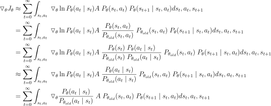
    

    <!-- $$\begin{align*}
    {\triangledown}_{\theta} J_\theta &\approx \sum_{t=0}^{\infty} \int_{s_t,a_t} \ {\triangledown}_{\theta} \ln{P_\theta (a_t \mid s_t)} A \ P_\theta(s_t,a_t) \ P_\theta(s_{t+1} \mid s_t, a_t) ds_t, a_t, s_{t+1} \\
    &= \sum_{t=0}^{\infty} \int_{s_t,a_t} \ {\triangledown}_{\theta} \ln{P_\theta (a_t \mid s_t)} A \ \frac{P_\theta(s_t,a_t)}{P_{\theta_{old}}(s_t,a_t)} \ P_{\theta_{old}}(s_t,a_t) \ P_\theta(s_{t+1} \mid s_t, a_t) ds_t, a_t, s_{t+1} \\
    &= \sum_{t=0}^{\infty} \int_{s_t,a_t} \ {\triangledown}_{\theta} \ln{P_\theta (a_t \mid s_t)} A \ \frac{P_\theta(s_t) \ P_\theta(a_t \mid s_t)}{P_{\theta_{old}}(s_t) \ P_{\theta_{old}}(a_t \mid s_t)} \ P_{\theta_{old}}(s_t,a_t) \ P_\theta(s_{t+1} \mid s_t, a_t) ds_t, a_t, s_{t+1} \\
    &\approx \sum_{t=0}^{\infty} \int_{s_t,a_t} \ {\triangledown}_{\theta} \ln{P_\theta (a_t \mid s_t)} A \ \frac{P_\theta(a_t \mid s_t)}{P_{\theta_{old}}(a_t \mid s_t)} \ P_{\theta_{old}}(s_t,a_t) \ P_\theta(s_{t+1} \mid s_t, a_t) ds_t, a_t, s_{t+1} \\
    &= \sum_{t=0}^{\infty} \int_{s_t,a_t} \ {\triangledown}_{\theta} \frac{P_\theta(a_t \mid s_t)}{P_{\theta_{old}}(a_t \mid s_t)} \ A \ P_{\theta_{old}}(s_t,a_t) \ P_\theta(s_{t+1} \mid s_t, a_t) ds_t, a_t, s_{t+1} \\
    \end{align*}$$ -->

    - By using importance sampling, you can update actor with sample data from old policy
    

        
    

    <!-- $$\begin{align*}
    \theta &\leftarrow \theta + \alpha {\triangledown}_{\theta} J_\theta\\
    &\leftarrow \theta + \alpha {\triangledown}_{\theta} \sum_{i=t-N+1}^{t} \frac{P_\theta(a_t \mid s_t)}{P_{\theta_{old}}(a_t \mid s_t)} \ A
    \end{align*}$$ -->

    - As we suppose $\frac{P_\theta(s_t)}{P_{\theta_{old}}(s_t)} = 1$, this is the contraints problem
    

        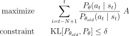
    

    <!-- $$\begin{align*}
    \mathrm{maximize} \qquad &\sum_{i=t-N+1}^{t} \frac{P_\theta(a_t \mid s_t)}{P_{\theta_{old}}(a_t \mid s_t)} \ A \\
    \mathrm{constraint} \qquad  &\mathrm{KL}[P_{\theta_{old}}, P_{\theta}] \le \delta \\
    \end{align*}$$ -->

2. Clipping
    - Convert KL divergence constraint problem to unconstraint problem.
    - Use clip to limit the importance ratio $r_t$ so that it doesn't change too much.
    - Limit the policy update range to prevent learning from becoming unstable due to large policy updates.
    - Set Policy gradient $\triangledown_\theta J_\theta$ as following:
    

        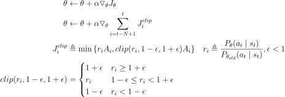
    

    <!-- $$\begin{align*}
    \theta &\leftarrow \theta + \alpha {\triangledown}_{\theta} J_\theta\\
    \theta &\leftarrow \theta + \alpha {\triangledown}_{\theta} \sum_{i=t-N+1}^{t} J_i^{clip}\\
    J_i^{clip} &\triangleq \min{\{ r_iA_i, clip(r_i, 1-\epsilon, 1+\epsilon) A_i \}} \quad r_i \triangleq \frac{P_\theta(a_t \mid s_t)}{P_{\theta_{old}}(a_t \mid s_t)} , \epsilon < 1\\
    clip(r_i, 1-\epsilon, 1+\epsilon) &= 
    \begin{cases}
    1+\epsilon & r_i \ge 1+\epsilon \\
    r_i        & 1-\epsilon \le r_i < 1+\epsilon \\
    1-\epsilon & r_i < 1-\epsilon \\
    \end{cases}
    \end{align*}$$ -->

3. GAE (Generalize Advantage Estimation)
    - Unlike the calculations made so far with the 1-step TD error, the calculations are made by considering all TDs.
    - Calculate every TD error by using exponential moving average to get $\widehat{A}_i^{GAE}$.
    

        
    

    <!-- $$\begin{align*}
    A_t^{(1)} \quad &=R_t+\gamma V(s_{t+1}) - V(s_t) \quad \triangleq \delta_t  \quad & \mathrm{1-setp \ TD \ error} \\
    A_t^{(2)} \quad &=R_t+\gamma R_{t+1} + \gamma^2 V(s_{t+2}) - V(s_t) \quad & \mathrm{2-setp \ TD \ error} \\
    \vdots \\
    A_t^{(i)} \quad &= \sum_{k=t}^{t+i-1}\gamma^{k-t}\delta_k & \mathrm{i-setp \ TD \ error} \\
    TD(\gamma) &= \sum_{n=1}^\infty (1-\lambda)\lambda^{n-1}A_t^{(n)}\\
    &= (1-\lambda)(\delta_t + \lambda(\delta_t + \gamma\delta_{t+1}) + \lambda^2(\delta_t + \gamma\delta_{t+1} + \gamma^2\delta_{t+2})+\dots)\\
    &= (1-\lambda)(\delta_t(1+\lambda+\lambda^2+\dots) + \gamma\delta_{t+1}(\lambda+\lambda^2+\dots)+\dots)\\
    &= (1-\lambda)(\delta_t \frac{1}{1-\lambda} + \gamma\delta_{t+1}\frac{\lambda}{1-\lambda} + \dots )\\
    &= \sum_{k=t}^\infty (\gamma\lambda)^{k-t}\delta_k \\
    &=\mathrm{GAE} \\
    &\triangleq \widehat{A}_i^{GAE} \\
    \end{align*}$$ -->
    
    - However, GAE computes infinite TD, but in reality, it uses N consecutive samples, so it is used in a limited way.
    

        
    

    <!-- $$\begin{align*}
    \widehat{A}_i^{GAE} &\triangleq \sum_{k=i}^{t} (\gamma\lambda)^{k-i}\delta_k \\
    \end{align*}$$ -->
- Update
    - You can update for every N steps.
    - Use $\sum$ as batch.
    - Reuse N samples as epoch.
    

        
    

    <!-- $$\begin{align*}
    Actor \quad
    \theta &\leftarrow \theta + \alpha {\triangledown}_{\theta} J_\theta\\
    &\leftarrow \theta + \alpha {\triangledown}_{\theta} \sum_{i=t-N+1}^{t} J_i^{clip} \\
    &\leftarrow \theta + \alpha {\triangledown}_{\theta} \sum_{i=t-N+1}^{t} \min{\{ r_i \widehat{A}_i^{GAE}, clip(r_i, 1-\epsilon, 1+\epsilon) \widehat{A}_i^{GAE} \}} \\
    Critic \quad
    w &\leftarrow w - \beta {\triangledown}_{w} L_w\\
    &\leftarrow w + \beta {\triangledown}_{w} \sum_{i=t-N+1}^{t} (R_i + \gamma V_w(s_{i+1})-V_w(s_i))^2\\
    \end{align*}$$ -->

## 12. Policy Iteration
- Policy Iteration
    - __Hard__ update the policy via argmax (Hard version of policy gradient)
    - A method of skip policy gradient and learning only the value function.
    - The following equation is repeated to find the optimal function.
    - Policy itertation modify the policy to take the action with __the highest action value function__.

<!-- $$\begin{align*}
&\pi'(a_t \mid s_t) &= 
\begin{cases}
1 & if \ a_t=\mathrm{argmax}_{a_t}A^\pi(s_t,a_t) \\
1 & otherwise
\end{cases}
\\
\\
&\mathrm{1. \ Policy \ Evaluate} &A(s_i,a_i)\\
&\mathrm{2. \ Policy \ Improvement} &\pi \leftarrow \pi'
\end{align*}$$ -->

## 13. SAC
### 1. Soft Actor Critic 2018
- Use Soft Policy Iteration
    - [Soft Actor-Critic: Off-Policy Maximum Entropy Deep Reinforcement Learning with a Stochastic Actor (2018)](https://arxiv.org/abs/1801.01290)
    - [Soft Actor-Critic Algorithms and Applications (2019)](https://arxiv.org/abs/1812.05905)
    - Repeat soft policy evaluation and soft policy improvement.
    - Soft Bellman equation from [maximum entropy](ConceptSummary.md#10-maximum-entropy).
    

    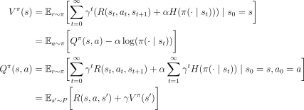
    

    <!-- $$\begin{align*}
    V^\pi(s) &= \mathbb{E}_{r \sim \pi} \biggl[ \sum_{t=0}^{\infty} \gamma^t (R(s_t,a_t,s_{t+1}) + \alpha H(\pi (\cdot \mid s_t))) \mid s_0 = s \biggr]\\
    &= \mathbb{E}_{a \sim \pi} \biggl[ Q^\pi (s,a) - \alpha \log(\pi(\cdot\mid s_t)) \biggr]\\
    Q^\pi(s,a) &= \mathbb{E}_{r \sim \pi} \biggl[ \sum_{t=0}^{\infty} \gamma^t R(s_t,a_t,s_{t+1}) + \alpha \sum_{t=1}^{\infty} \gamma^t H(\pi (\cdot \mid s_t)) \mid s_0 = s, a_0 = a\biggr]\\
    &= \mathbb{E}_{s' \sim P} \biggl[R(s,a,s') + \gamma V^\pi(s') \biggr]\\
    \end{align*}$$ -->

    - Soft Policy Evaluation
        - Get soft value
        - Soft bellman backup operator $\mathcal{T}^\pi$
        

        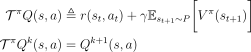
        

        <!-- $$\begin{align*}
        \mathcal{T}^\pi Q(s,a) &\triangleq r(s_t,a_t) + \gamma \mathbb{E}_{s_{t+1} \sim P} \biggl[V^\pi(s_{t+1}) \biggr]\\
        \mathcal{T}^\pi Q^{k}(s,a) &= Q^{k+1}(s,a)
        \end{align*}$$ -->

        - Lemma 1
            - if $Q^0 : \mathcal{S} \times \mathcal{A} \rightarrow \mathbb{R}$ with $|A| < \infty$, them sequence $Q^k$ will converge to the soft Q value of $\pi$ as $k\rightarrow\infty$ 

    - Soft Policy Improvement
        - Modify the policy to give increasingly higher probabilities as the action value function gets higher.
        

        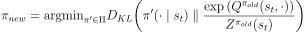
        

        <!-- $$\begin{align*}
        \pi_{new} &= \mathrm{argmin}_{\pi' \in \Pi}D_{KL}\biggr( \pi'(\cdot \mid s_t) \parallel \frac{\exp{(Q^{\pi_{old}}(s_t,\cdot))}}{Z^{\pi_{old}}(s_t)} \biggl) \\
        \end{align*}$$ -->

        - Lemma 2
            - New, projected policy has a higher value than the old policy.
            - $Q^{\pi_{new}}(s_t, a_t) \ge Q^{\pi_{old}}(s_t, a_t)$ for all $(s_t, a_t) \in \mathcal{S} \times \mathcal{A} \rightarrow \mathbb{R}$ with $|A| < \infty$.
    - Theorem 1 (Soft Policy Iteration)
        - Repeated application of __soft policy evaluation__ and __soft policy improvement__ from any $π∈Π$ converges to a policy $π^∗$ such that $Q^{\pi^*}(s_t,a_t)\ge Q^{\pi}(s_t,a_t)$ for all $\pi \in \Pi$ and $(s_t,a_t)\in \mathcal{S} \times \mathcal{A}$ assuming $|A| < \infty$.

- Use 5 function approximators for both the Q-function and the policy.
    1. Policy $\pi_\phi(a_t \mid s_t)$
    2. State value function $V_\psi(s_t)$
    3. Traget state value function $V_{\bar{\psi}}(s_t)$
    4. Soft Q-function $Q_{\theta_1}(s_t, a_t)$
    5. Soft Q-function $Q_{\theta_2}(s_t, a_t)$

- Reparameterization trick in policy
    - Common sampling method: $a \sim \mathcal{N}(\mu(s),\sigma(s))$
    - We can't directly apply gradient descent during this sampling process.
    - Use reparameterization trick to change sampling method. It enable us to use gradient descent.
    - Get random sample $\epsilon$ from gaussian distribution $\epsilon \sim \mathcal{N}(0,I)$
        

        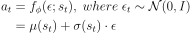
        

        <!-- $$\begin{align*}
        a_t &= f_{\phi}(\epsilon;s_t), \ where\ \epsilon_t \sim \mathcal{N}(0,I) \\
        &=\mu(s_t) + \sigma(s_t) \cdot \epsilon
        \end{align*}$$ -->

- Two Q-function to avoid overestimation bias
    - The problem of overestimation, where the estimate of a function is higher than its actual value, often occurs especially in offline rl.
    - During the maximization process, the Q-function may overestimate suboptimal actions.
    - Avoid overestimation by choosing the smaller value of the two Q-functions.

- Objective function
    - Use temporal difference learning for soft Q-function.
    - Use stochastic gradient descent.
    - $D$ is replay buffer.
        

        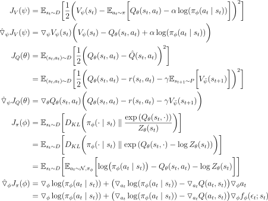
        

        <!-- $$\begin{align*}
        J_V(\psi) &= \mathbb{E}_{s_t \sim D} \biggl[\frac{1}{2} \biggl( V_\psi(s_t) - \mathbb{E}_{a_t \sim \pi} \biggl[ Q_\theta(s_t,a_t) - \alpha \log(\pi_\phi(a_t\mid s_t)) \biggr] \biggr)^2 \biggr]\\
        \hat{\triangledown}_{\psi} J_V(\psi) &= {\triangledown}_{\psi}V_{\psi}(s_t) \biggl( V_\psi(s_t) - Q_\theta(s_t,a_t) + \alpha \log(\pi_\phi(a_t\mid s_t)) \biggr)\\
        J_Q(\theta) &= \mathbb{E}_{(s_t,a_t) \sim D} \biggl[\frac{1}{2} \biggl(Q_\theta(s_t,a_t) - \hat{Q}(s_t,a_t) \biggr)^2 \biggr]\\
        &= \mathbb{E}_{(s_t,a_t) \sim D} \biggl[\frac{1}{2} \biggl(Q_\theta(s_t,a_t) - r(s_t,a_t) - \gamma \mathbb{E}_{s_{t+1} \sim P} \biggl[V_{\bar{\psi}}(s_{t+1}) \biggr] \biggr)^2 \biggr]\\
        \hat{\triangledown}_{\psi} J_Q(\theta) &= {\triangledown}_{\theta}Q_{\theta}(s_t, a_t) \biggl( Q_\theta(s_t,a_t) - r(s_t,a_t) - \gamma V_{\bar{\psi}}(s_{t+1}) \biggr)\\
        J_{\pi}(\phi) &= \mathbb{E}_{s_t \sim D} \biggl[D_{KL}\biggr( \pi_\phi(\cdot \mid s_t) \parallel \frac{\exp{(Q_\theta(s_t,\cdot))}}{Z_\theta(s_t)} \biggl) \biggr]\\
        &= \mathbb{E}_{s_t \sim D} \biggl[D_{KL}\biggr( \pi_\phi(\cdot \mid s_t) \parallel \exp{(Q_\theta(s_t,\cdot) - \log{Z_\theta(s_t)})} \biggl) \biggr]\\
        &= \mathbb{E}_{s_t \sim D} \biggl[\mathbb{E}_{a_t \sim \mathcal{N},\pi_\phi} \biggl[\log \bigr( \pi_\phi(a_t \mid s_t)\bigr) - Q_\theta(s_t,a_t) - \log{Z_\theta(s_t)} \biggr] \biggr]\\
        \hat{\triangledown}_{\phi} J_{\pi}(\phi) &= {\triangledown}_{\phi}\log({\pi_\phi}(a_t \mid s_t)) + \bigl({\triangledown}_{a_t} \log({\pi_\phi}(a_t \mid s_t)) - {\triangledown}_{a_t} Q(a_t, s_t) \bigr){\triangledown}_{\phi}a_t\\
        &= {\triangledown}_{\phi}\log({\pi_\phi}(a_t \mid s_t)) + \bigl({\triangledown}_{a_t} \log({\pi_\phi}(a_t \mid s_t)) - {\triangledown}_{a_t} Q(a_t, s_t) \bigr){\triangledown}_{\phi}f_\phi(\epsilon_t;s_t)\\
        \end{align*}$$ -->

### 2. Soft Actor Critic 2019
- The temperature parameter $\alpha$ of maximum entropy is not fixed, calculated.
- Not using soft value function.
- Modify the policy to give increasingly higher probabilities as the action value function gets higher.
    - Use same $\alpha$ in maximum entropy temperature parameter
    - As $α$ gets smaller, $\frac{1}{α}$ gets larger, emphasizing the differences in Q-values ​​more, making the policy more deterministic. 
    - As $α$ gets larger, $\frac{1}{α}$ gets smaller, emphasizing the differences in Q-values ​​less, making the policy more random and exploratory.
    

    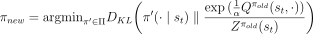
    

    <!-- $$\begin{align*}
    \pi_{new} &= \mathrm{argmin}_{\pi' \in \Pi}D_{KL}\biggr( \pi'(\cdot \mid s_t) \parallel \frac{\exp{(\frac{1}{\alpha}Q^{\pi_{old}}(s_t,\cdot))}}{Z^{\pi_{old}}(s_t)} \biggl) \\
    \end{align*}$$ -->

- Automating entropy adjustment
    - Automatically adjusting $α$ during learning allows the agent to maintain appropriate exploration and convergence depending on the state.
    1. To do this, we add a constraint that keeps the entropy at a certain level.
        - Minumim desired entropy $\mathcal{H}$.
            - Recommended values ​​are - number of actions $\mathcal{H} = -dim(A)$.
        - Employ (approximate) dynamic programming and rewrite objective as iterated maximization.
        

        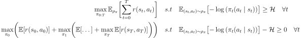
        

        <!-- $$\begin{align*}
        \max_{\pi_{0:T}}\mathbb{E}_{\rho_\pi} \biggl[ \sum_{t=0}^{T} r(s_t,a_t) \biggr] \quad &s.t \quad \mathbb{E}_{(s_t,a_t) \sim \rho_\pi} \bigl[ -\log{(\pi_t(a_t \mid s_t))}\bigr] \ge \mathcal{H} \quad \forall t \\
        \max_{\pi_{0}} \biggl( \mathbb{E} [r(s_0,a_0)] + \max_{\pi_{1}}\biggl(\mathbb{E} [\dots] + \max_{\pi_{T}}\mathbb{E} [r(s_T,a_T)] \biggr)\biggr) \quad &s.t \quad \mathbb{E}_{(s_t,a_t) \sim \rho_\pi} \bigl[ -\log{(\pi_t(a_t \mid s_t))}\bigr] - \mathcal{H}\ge 0 \quad \forall t
        \end{align*}$$ -->

    2. Convert it to [duality problem](./ConceptSummary.md#13-duality) with dual variable $\alpha_T$. Start from last time step.
        - Objective function(linear) and constraint(entropy) is both convex -> Satisfy slater’s condition -> Strong duality
        

        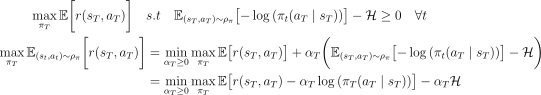
        

        <!-- $$\begin{align*}
        \max_{\pi_{T}}\mathbb{E} \biggl[ r(s_T,a_T) \biggr] \quad &s.t \quad \mathbb{E}_{(s_T,a_T) \sim \rho_\pi} \bigl[ -\log{(\pi_t(a_T \mid s_T))}\bigr] - \mathcal{H} \ge 0 \quad \forall t \\
        \max_{\pi_{T}}\mathbb{E}_{(s_t,a_t) \sim \rho_\pi} \biggl[r(s_T,a_T) \biggr] &=\min_{\alpha_T \ge 0} \max_{\pi_T} \mathbb{E} \bigl[ r(s_T,a_T)\bigr] + \alpha_T \biggl(\mathbb{E}_{(s_T,a_T) \sim \rho_\pi} \bigl[ -\log{(\pi_t(a_T \mid s_T))}\bigr] - \mathcal{H} \biggr) \\
        &=\min_{\alpha_T \ge 0} \max_{\pi_T} \mathbb{E} \bigl[ r(s_T,a_T)- \alpha_T \log{(\pi_T(a_T \mid s_T))}\bigr] - \alpha_T \mathcal{H} \\
        \end{align*}$$ -->

        - Dual objective is closely related to the maximum entropy objective with respect to the policy.
        - optimal policy is the maximum entropy policy corresponding to temperature $\alpha$.
        

        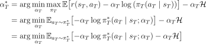
        

        <!-- $$\begin{align*}
        \alpha^*_T &= \mathrm{arg} \min_{\alpha_T}\max_{\pi_T} \mathbb{E} \bigl[ r(s_T,a_T)- \alpha_T \log{(\pi_T(a_T \mid s_T))}\bigr]  - \alpha_T \mathcal{H} \\
        &= \mathrm{arg} \min_{\alpha_T}\mathbb{E}_{a_T \sim \pi_T^*}\bigl[ -\alpha_T \log{\pi_T^*(a_T \mid s_T;\alpha_T)} \bigr]  - \alpha_T \mathcal{H} \\
        &= \mathrm{arg} \min_{\alpha_T}\mathbb{E}_{a_T \sim \pi_T^*}\bigl[ -\alpha_T \log{\pi_T^*(a_T \mid s_T;\alpha_T)} - \alpha_T \mathcal{H} \bigr] \\
        \end{align*}$$ -->

    3. Soft Q-function with $\alpha$
        

        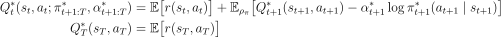
        

        <!-- $$\begin{align*}
        Q^*_t(s_t,a_t;\pi_{t+1:T}^*,\alpha_{t+1:T}^*)&=\mathbb{E}\bigl[r(s_t,a_t)\bigr]+\mathbb{E}_{\rho_\pi}\bigl[ Q_{t+1}^*(s_{t+1}, a_{t+1})-\alpha_{t+1}^*\log{\pi_{t+1}^*(a_{t+1}\mid s_{t+1})} \bigr] \\
        Q^*_T(s_T,a_T)&=\mathbb{E}\bigl[r(s_T,a_T)\bigr] \\
        \end{align*}$$ -->

    4. Convert it to duality problem with dual variable $\alpha_{T-1}$.
        

        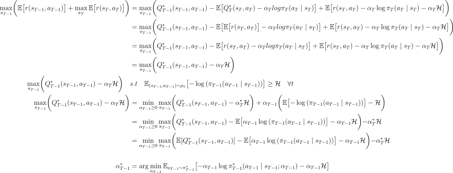
        

        <!-- $$\begin{align*}
        \max_{\pi_{T-1}} \biggl( \mathbb{E} \bigl[r(s_{T-1},a_{T-1}) \bigr] + \max_{\pi_{T}}\mathbb{E} \bigl[r(s_T,a_T) \bigr] \bigg)
        &= \max_{\pi_{T-1}} \biggl( Q_{T-1}^*(s_{T-1}, a_{T-1}) - \mathbb{E}\bigl[ Q_{T}^*(s_{T}, a_{T})-\alpha_{T}log{\pi_{T}(a_{T}\mid s_{T})} \bigr] + \mathbb{E} \bigl[r(s_T,a_T) -\alpha_T \log{\pi_T(a_T \mid s_T)} - \alpha_T \mathcal{H} \bigr] \bigg)\\
        &= \max_{\pi_{T-1}} \biggl( Q_{T-1}^*(s_{T-1}, a_{T-1}) - \mathbb{E}\bigl[ \mathbb{E}\bigl[r(s_T,a_T)\bigr]-\alpha_{T}log{\pi_{T}(a_{T}\mid s_{T})} \bigr] + \mathbb{E} \bigl[r(s_T,a_T) -\alpha_T \log{\pi_T(a_T \mid s_T)} - \alpha_T \mathcal{H} \bigr] \bigg)\\
        &= \max_{\pi_{T-1}} \biggl( Q_{T-1}^*(s_{T-1}, a_{T-1}) - \mathbb{E}\bigl[ r(s_T,a_T)-\alpha_{T}log{\pi_{T}(a_{T}\mid s_{T})} \bigr] + \mathbb{E} \bigl[r(s_T,a_T) -\alpha_T \log{\pi_T(a_T \mid s_T)} - \alpha_T \mathcal{H} \bigr] \bigg)\\
        &= \max_{\pi_{T-1}} \biggl( Q_{T-1}^*(s_{T-1}, a_{T-1})-\alpha_{T}\mathcal{H} \bigg) \\
        \max_{\pi_{T-1}} \biggl( Q_{T-1}^*(s_{T-1}, a_{T-1})-\alpha_{T}\mathcal{H} \bigg) \quad
        &s.t \quad \mathbb{E}_{(s_{T-1},a_{T-1}) \sim \rho_\pi} \bigl[ -\log{(\pi_{T-1}(a_{T-1} \mid s_{T-1}))}\bigr] \ge \mathcal{H} \quad \forall t \\
        \max_{\pi_{T-1}} \biggl( Q_{T-1}^*(s_{T-1}, a_{T-1})-\alpha_{T}\mathcal{H} \bigg) 
        &= \min_{\alpha_{T-1} \ge 0} \max_{\pi_{T-1}}\biggl( Q_{T-1}^*(s_{T-1}, a_{T-1})-\alpha_{T}^*\mathcal{H} \bigg) + \alpha_{T-1} \biggl( \mathbb{E} \bigl[ -\log{(\pi_{T-1}(a_{T-1} \mid s_{T-1}))}\bigr] - \mathcal{H} \biggl) \\
        &= \min_{\alpha_{T-1} \ge 0} \max_{\pi_{T-1}}\biggl( Q_{T-1}^*(s_{T-1}, a_{T-1}) - \mathbb{E} \bigl[ \alpha_{T-1} \log{(\pi_{T-1}(a_{T-1} \mid s_{T-1}))}\bigr] - \alpha_{T-1} \mathcal{H} \biggl) -\alpha_{T}^*\mathcal{H}\\
        &= \min_{\alpha_{T-1} \ge 0} \max_{\pi_{T-1}}\biggl( \mathbb{E}[Q_{T-1}^*(s_{T-1}, a_{T-1})] - \mathbb{E} \bigl[ \alpha_{T-1} \log{(\pi_{T-1}(a_{T-1} \mid s_{T-1}))}\bigr] - \alpha_{T-1} \mathcal{H} \biggl) -\alpha_{T}^*\mathcal{H} \\ \\
        \alpha^*_{T-1} &= \mathrm{arg} \min_{\alpha_{T-1}}\mathbb{E}_{a_{T-1} \sim \pi_{T-1}^*}\bigl[ -\alpha_{T-1} \log{\pi_{T-1}^*(a_{T-1} \mid s_{T-1};\alpha_{T-1})} - \alpha_{T-1} \mathcal{H} \bigr] \\
        \end{align*}$$ -->

    5. Optimal dual variable
        

        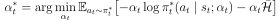
        

        <!-- $$\begin{align*}
        \alpha^*_t &= \mathrm{arg} \min_{\alpha_t}\mathbb{E}_{a_t \sim \pi_t^*}\bigl[ -\alpha_t \log{\pi_t^*(a_t \mid s_t;\alpha_t)} - \alpha_t \mathcal{\bar{H}} \bigr] \\
        \end{align*}$$ -->
        

- Use 5 function approximators for both the Q-function and the policy.
    1. Policy $\pi_\phi(a_t \mid s_t)$
    2. Soft Q-function $Q_{\theta_1}(s_t, a_t)$
    3. Soft Q-function $Q_{\theta_2}(s_t, a_t)$
    2. Target Soft Q-function $Q_{\bar{\theta}_1}(s_t, a_t)$
    3. Target Soft Q-function $Q_{\bar{\theta}_2}(s_t, a_t)$

    

    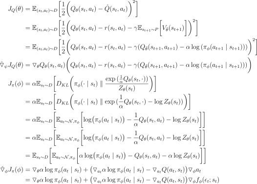
    

    <!-- $$\begin{align*}
    J_Q(\theta) &= \mathbb{E}_{(s_t,a_t) \sim D} \biggl[\frac{1}{2} \biggl(Q_\theta(s_t,a_t) - \hat{Q}(s_t,a_t) \biggr)^2 \biggr]\\
    &= \mathbb{E}_{(s_t,a_t) \sim D} \biggl[\frac{1}{2} \biggl(Q_\theta(s_t,a_t) - r(s_t,a_t) - \gamma \mathbb{E}_{s_{t+1} \sim P} \biggl[V_{\bar{\theta}}(s_{t+1}) \biggr] \biggr)^2 \biggr]\\
    &= \mathbb{E}_{(s_t,a_t) \sim D} \biggl[\frac{1}{2} \biggl(Q_\theta(s_t,a_t) - r(s_t,a_t) - \gamma (Q_{\bar{\theta}}(s_{t+1},a_{t+1}) - \alpha \log{(\pi_\phi(a_{t+1}\mid s_{t+1}))}) \biggr)^2 \biggr]\\
    \hat{\triangledown}_{\psi} J_Q(\theta) &= {\triangledown}_{\theta}Q_{\theta}(s_t, a_t) \biggl(Q_\theta(s_t,a_t) - r(s_t,a_t) - \gamma (Q_{\bar{\theta}}(s_{t+1},a_{t+1}) - \alpha \log{(\pi_\phi(a_{t+1}\mid s_{t+1}))}) \biggr)\\
    J_{\pi}(\phi) &= \alpha \mathbb{E}_{s_t \sim D} \biggl[D_{KL}\biggr( \pi_\phi(\cdot \mid s_t) \parallel \frac{\exp{(\frac{1}{\alpha}Q_\theta(s_t,\cdot))}}{Z_\theta(s_t)} \biggl) \biggr]\\
    &= \alpha \mathbb{E}_{s_t \sim D} \biggl[D_{KL}\biggr( \pi_\phi(\cdot \mid s_t) \parallel \exp{(\frac{1}{\alpha}Q_\theta(s_t,\cdot) - \log{Z_\theta(s_t)})} \biggl) \biggr]\\
    &= \alpha \mathbb{E}_{s_t \sim D} \biggl[\mathbb{E}_{a_t \sim \mathcal{N},\pi_\phi} \biggl[\log \bigr( \pi_\phi(a_t \mid s_t)\bigr) - \frac{1}{\alpha}Q_\theta(s_t,a_t) - \log{Z_\theta(s_t)} \biggr] \biggr] \\
    &= \alpha \mathbb{E}_{s_t \sim D} \biggl[\mathbb{E}_{a_t \sim \mathcal{N},\pi_\phi} \biggl[\log \bigr( \pi_\phi(a_t \mid s_t)\bigr) - \frac{1}{\alpha}Q_\theta(s_t,a_t) - \log{Z_\theta(s_t)} \biggr] \biggr]\\
    &= \mathbb{E}_{s_t \sim D} \biggl[\mathbb{E}_{a_t \sim \mathcal{N},\pi_\phi} \biggl[\alpha \log \bigr( \pi_\phi(a_t \mid s_t)\bigr) - Q_\theta(s_t,a_t) - \alpha \log{Z_\theta(s_t)} \biggr] \biggr]\\
    \hat{\triangledown}_{\phi} J_{\pi}(\phi) &= {\triangledown}_{\theta} \alpha \log{\pi_\phi}(a_t \mid s_t) + \bigl({\triangledown}_{a_t} \alpha \log{\pi_\phi}(a_t \mid s_t) - {\triangledown}_{a_t} Q(a_t , s_t) \bigr){\triangledown}_{\phi}a_t\\
    &= {\triangledown}_{\theta} \alpha \log{\pi_\phi}(a_t \mid s_t) + \bigl({\triangledown}_{a_t} \alpha \log{\pi_\phi}(a_t \mid s_t) - {\triangledown}_{a_t} Q(a_t, s_t) \bigr){\triangledown}_{\phi}f_\phi(\epsilon_t;s_t)\\
    \end{align*}$$ -->

- Enforcing Action Bounds
    - Bound actions to finite interval ($u \rightarrow a$).
    - if $a = \tanh{(u)}$, 
        

        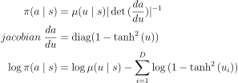
        

        <!-- $$\begin{align*}
        \pi(a \mid s) &= \mu(u \mid s)|\det{(\frac{da}{du})}|^{-1} \\
        jacobian \ \frac{da}{du} &= \mathrm{diag}(1-\tanh^2{(u)}) \\
        \log{\pi(a \mid s)} &= \log{\mu(u \mid s)} - \sum_{i=1}^{D}\log{(1-\tanh^2{(u_i)})} \\
        \end{align*}$$ -->

## 0. etc
