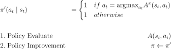

# Reinforcement Learning Concept Summary

# Table of Contents
1. [Reason Why Failed the Export](#1-reason-why-failed-the-export)
2. [Expensive part in RL](#2-expensive-part-in-rl)
3. [Concept to update policy](#3-concept-to-update-policy)
4. [Types of RL](#4-types-of-rl)
5. [Things to consider when choosing an algorithm](#5-things-to-consider-when-choosing-an-algorithm)
6. [Baselines in policy gradient](#6-baselines-in-policy-gradient)
7. [Importance Sampling](#7-importance-sampling)
8. [Policy Gradient and Policy Iteration](#8-policy-gradient-and-policy-iteration)
9. [Entropy](#9-entropy)
10. [Maximum Entropy](#10-maximum-entropy)
11. [Cross Entropy](#11-cross-entropy)
12. [KL divergence](#12-kl-divergence)

## 1. Reason Why Failed the Export
- Causal confusion
    - If cause and effect are not clear and there is room for confusion, learning may be difficult.
- Non-Markovian behavior
    - What happened in the past affects the present
    - Use sequence model (Transformers, LSTM cells, ...)
- Multimodal behavior
    - When the number of possible actions in a situation is diverse
    - Mixture of Gaussians $\sum_i w_i \mathcal{N}(\mu_i , \Sigma_i)$
    - Latent variable models
    - Diffusion models

## 2. Expensive part in RL
- Generate samples (generate train data)
    - It is much cheaper to obtain data through simulation.
- Fit a model (calculate the expected return)
    - Learning the entire model is expensive.
    - Reward-based policy learning is inexpensive.

## 3. Concept to update policy
1. If we have policy $\pi$, and we konw $Q(s,a)$, then we can improve $\pi$.
2. Compute gradient to increase probability of good action a (policy gradient)

## 4. Types of RL
- Value-based
    - Q-learning, DQN, Temporal difference learning, Fitted value iteration
    - Estimate value function or Q-function of the optimal policy (no explicit policy).
- Policy Gradients 
    - REINFORCE, Natural policy gradient, Trust region policy optimization
- Actor-critic
    - Asynchronous advantage actor-critic (A3C), Soft actor-critic (SAC)
    - Estimate value function or Q-function of the current policy, use it to improve policy.
- Model-Based RL
    - Dyna, Guided policy search 
    - Estimate the transition model, and
        - Use it for planning (no explicit policy).
        - Use it to improve a policy.
    - Learn physics how environment work.
    - Learn model for trajectory optimization/ optimal control.
    - Use the model to learn a value function.

## 5. Things to consider when choosing an algorithm
- Sample efficency (on, off polocy)
- Stability (Converge)
- Stochastic or deterministic
- Continuous or discrete
- Episodic or infinite
- Easier to represent the policy
- Easier to represent the model

## 6. Baselines in policy gradient
- Training policy gradient is unstable, in part because the variance of the gradient estimates is large.
    - Large variance means, the $G_t$ value obtained by progressing the episode is sometimes very large and sometimes very small.
    - This is because the progress in each episode is different, and various randomnesses exist in the environment, such as the initial state distribution, policy distribution, and transition probability distribution.
- Baseline
    - $b=\frac{1}{N}\sum_{i=1}^{N}r(\tau)$
- Subtracting a baseline
    - Not effect the policy gradient. (unbiased in expectation)
    

        
    

    <!-- $$\begin{align*}
    {\triangledown}_{\theta} J_\theta &\approx \mathbb{E}_{\tau \sim p_\theta(\tau)}[G_0 \ {\triangledown}_{\theta} \ \ln{P_\theta(\tau)}]\\
    \mathbb{E}_{\tau \sim p_\theta(\tau)}[{\triangledown}_{\theta} \ \ln{P_\theta(\tau)} b] &= \int_\tau \ {\triangledown}_{\theta} \ \ln{P_\theta(\tau)} \ P_\theta(\tau) \ b \ d\tau\\
    &= \int_\tau \ {\triangledown}_{\theta} \ P_\theta(\tau) \ b \ d\tau\\
    &= b {\triangledown}_{\theta}  \int_\tau \ P_\theta(\tau) \ d\tau\\
    &= b {\triangledown}_{\theta}  1\\
    &=0 \\
    \end{align*}$$ -->

    - It means:
    

        
    

    <!-- $$\begin{align*}
    \mathbb{E}_{\tau \sim p_\theta(\tau)}[{\triangledown}_{\theta} \ \ln{P_\theta(\tau)(G_0 - b)}] = \mathbb{E}_{\tau \sim p_\theta(\tau)}[{\triangledown}_{\theta} \ \ln{P_\theta(\tau)(G_0)}] = {\triangledown}_{\theta} J_\theta\\
    \end{align*}$$ -->

- Subtracting a baseline reduce variance

    

<!-- $$\begin{align*}
\mathrm{Var_{}} &= \mathbb{E}[x^2] - \mathbb{E}[x]^2 \\
&= \mathbb{E}_{\tau \sim p_\theta(\tau)}[({\triangledown}_{\theta} \ \ln{P_\theta(\tau)(G_0 - b)})^2] - \mathbb{E}_{\tau \sim p_\theta(\tau)}[{\triangledown}_{\theta} \ \ln{P_\theta(\tau)(G_0 - b)}]^2 \\
&= \mathbb{E}_{\tau \sim p_\theta(\tau)}[({\triangledown}_{\theta} \ \ln{P_\theta(\tau)(G_0 - b)})^2] - \mathbb{E}_{\tau \sim p_\theta(\tau)}[{\triangledown}_{\theta} \ \ln{P_\theta(\tau)G_0}]^2 \\
\frac{d\mathrm{Var}}{db} &= \frac{d}{db} \mathbb{E}_{\tau \sim p_\theta(\tau)}[({\triangledown}_{\theta} \ \ln{P_\theta(\tau)(G_0 - b)})^2] \\
&= \frac{d}{db} \mathbb{E}_{\tau \sim p_\theta(\tau)}[(g(\tau)(G_0 - b))^2] \\
&= -2\mathbb{E}_{\tau \sim p_\theta(\tau)}[g(\tau)^2G_0] + 2b\mathbb{E}_{\tau \sim p_\theta(\tau)}[g(\tau)^2]\\
b&=\frac{\mathbb{E}_{\tau \sim p_\theta(\tau)}[g(\tau)^2G_0]}{\mathbb{E}_{\tau \sim p_\theta(\tau)}[g(\tau)^2]} \\
\end{align*}$$ -->

## 7. Importance Sampling
- Use the sample from $\bar{P}$ to learn while my RL policy is now $P$.
- Convert on-policy RL to off-policy RL.

    

<!-- $$\begin{align*}
\mathbb{E}_{x \sim p(x)}[f(x)] &= \int p(x)f(x)dx\\
&= \int \frac{\bar{p}(x)}{\bar{p}(x)}p(x)f(x)dx\\
&= \int \bar{p}(x)\frac{p(x)}{\bar{p}(x)}f(x)dx\\
&= \mathbb{E}_{x \sim \bar{p}(x)} \biggl[ \frac{p(x)}{\bar{p}(x)}f(x) \biggr] \\
\end{align*}$$ -->

- In policy gradient,

    

<!-- $$\begin{align*}
\frac{P_\theta(\tau)}{\bar{P}(\tau)}&=\frac{P(s_1)\prod_{t=1}^T P_\theta(a_t \mid s_t) P(s_{t+1}\mid s_t,a_t)}{P(s_1)\prod_{t=1}^T \bar{P}(a_t \mid s_t) P(s_{t+1}\mid s_t,a_t)}\\
&\approx \frac{\prod_{t=1}^T P_\theta(a_t \mid s_t)}{\prod_{t=1}^T \bar{P}(a_t \mid s_t)}\\
{\triangledown}_{\theta}J_\theta&=\mathbb{E}_{\tau \sim p_\theta} [G_0 \ {\triangledown}_{\theta} \ \ln{P_\theta(\tau)}]\\
&=\mathbb{E}_{\tau \sim \bar{p}} \biggl[ \frac{p_\theta(\tau)}{\bar{p}(\tau)} \ G_0 \ {\triangledown}_{\theta} \ \ln{P_\theta(\tau)} \biggr]\\
&\approx \frac{1}{N}\sum_{i=1}^N\sum_{t=1}^T \frac{ P_\theta(a_t \mid s_t)}{ \bar{P}(a_t \mid s_t)} \ G_0 \ {\triangledown}_{\theta} \ \ln{P_\theta(a_{i,t} \mid s_{i,t})}
\end{align*}$$ -->

## 8. Policy Gradient and Policy Iteration
- Policy gradient is __Soft__ version of policy iteration. 
    - Soft = The policy is stochastic rather than deterministic.
    - If advantage estimator is nor perfect, soft policy  change is reasonable.

<!-- $$\begin{align*}
&\mathrm{0. \ Evaluate \ (exmaple)} \quad &A(s_i,a_i) &= r(s_i, a_i) + V(s'_i) - V(s_i)\\
&\mathrm{1. \ Calulate \ Objective} &{\triangledown}_{\theta}J &\approx \sum_i {\triangledown}_{\theta} \log{P_\theta(a_i \mid s_i)} Q(s_i, a_i) \\
&\mathrm{2. \ Update} \quad &\theta &\leftarrow \theta + \alpha {\triangledown}_{\theta}J(\theta)
\end{align*}$$ -->

- Policy iteration is __Hard__ version of policy gradient.
    - Hard = The policy is deterministic rather than stochastic.
    - Calculate the advantage from previous policy and update policy

<!-- $$\begin{align*}
&\pi'(a_t \mid s_t) &= 
\begin{cases}
1 & if \ a_t=\mathrm{argmax}_{a_t}A^\pi(s_t,a_t) \\
1 & otherwise
\end{cases}
\\
\\
&\mathrm{1. \ Evaluate} &A(s_i,a_i)\\
&\mathrm{2. \ Set} &\pi \leftarrow \pi'
\end{align*}$$ -->

- If we express policy gradient as policy iteration, it is as follows.

<!-- $$\begin{align*}
J(\theta') - J(\theta)  &= J(\theta') - \mathbb{E}_{s_0 \sim p(s_0)}[V^{\pi_\theta}(s_0)]\\
&= J(\theta') - \mathbb{E}_{\tau \sim p_{\theta'}(\tau)}[V^{\pi_\theta}(s_0)]\\
&= J(\theta') - \mathbb{E}_{\tau \sim p_{\theta'}(\tau)}\biggl[ \sum_{t=0}^{\infty} \gamma^t V^{\pi_\theta}(s_t) - \sum_{t=1}^{\infty} \gamma^t V^{\pi_\theta}(s_t) \biggr]\\
&= J(\theta') + \mathbb{E}_{\tau \sim p_{\theta'}(\tau)}\biggl[ \sum_{t=0}^{\infty} \gamma^t (\gamma V^{\pi_\theta}(s_{t+1}) - V^{\pi_\theta}(s_t)) \biggr]\\
&= \mathbb{E}_{\tau \sim p_{\theta'}(\tau)}\biggl[ \sum_{t=0}^{\infty} \gamma^t r(s_t, a_t) \biggr] + \mathbb{E}_{\tau \sim p_{\theta'}(\tau)}\biggl[ \sum_{t=0}^{\infty} \gamma^t (\gamma V^{\pi_\theta}(s_{t+1}) - V^{\pi_\theta}(s_t)) \biggr]\\
&= \mathbb{E}_{\tau \sim p_{\theta'}(\tau)}\biggl[ \sum_{t=0}^{\infty} \gamma^t (r(s_t, a_t) + \gamma V^{\pi_\theta}(s_{t+1}) - V^{\pi_\theta}(s_t)) \biggr]\\
&= \mathbb{E}_{\tau \sim p_{\theta'}(\tau)}\biggl[ \sum_t \gamma^t A^{\pi_\theta}(s_t, a_t) \biggr] \\
J(\theta') - J(\theta)  &= \mathbb{E}_{\tau \sim p_{\theta'}(\tau)}\biggl[ \sum_t \gamma^t A^{\pi_\theta}(s_t, a_t) \biggr] \\
\end{align*}$$ -->

- This means that the improvement of $J(\theta') - J(\theta)$ is same as the advantage from previous policy under trajectory distribution from new policy.
- Use importance sampling to delete $\theta'$ for maximize $J(\theta')$

<!-- $$\begin{align*}
\mathbb{E}_{\tau \sim p_{\theta'}(\tau)}\biggl[ \sum_t \gamma^t A^{\pi_\theta}(s_t, a_t) \biggr]
&= \sum_t \mathbb{E}_{s_t \sim p_{\theta'}(s_t)}\biggl[ \mathbb{E}_{a_t \sim p_{\theta'}(a_t \mid s_t)} [ \gamma^t A^{\pi_\theta}(s_t, a_t)]\biggr] \\
&= \sum_t \mathbb{E}_{s_t \sim p_{\theta'}(s_t)}\biggl[ \mathbb{E}_{a_t \sim p_{\theta'}(a_t \mid s_t)} [ \frac{p_{\theta'}(a_t \mid s_t)}{p_{\theta}(a_t \mid s_t)} \gamma^t A^{\pi_\theta}(s_t, a_t)]\biggr] \\
&\approx \sum_t \mathbb{E}_{s_t \sim p_{\theta}(s_t)}\biggl[ \mathbb{E}_{a_t \sim p_{\theta'}(a_t \mid s_t)} [ \frac{p_{\theta'}(a_t \mid s_t)}{p_{\theta}(a_t \mid s_t)} \gamma^t A^{\pi_\theta}(s_t, a_t)]\biggr]
\end{align*}$$ -->

- To satisfy the assumption, $p_{\theta}(s_t), p_{\theta'}(s_t)$ should similar.
    - Use TV Divergence, KL Divergence, Clipping, ...

## 9. Entropy
- A quantification of the uncertainty of an event that can occur within a certain probability distribution.
- The higher the entropy, the more unpredictable the distribution is; the lower it is, the easier it is to predict.
- Uncertainty is greatest when the likelihood of an event occurring is __evenly distributed__.
- Entropy H is defined as follows for the probability p(x) of occurrence of each event x in a probability distribution P

<!-- $$\begin{align*}
H(P(\tau)) &= - \sum_{x \in \tau}P(x) \log{P(x)} \quad &\mathrm{Discrete \ Probability \ Distribution}\\
&= - \int_{-\infty}^{\infty} P(x) \log{P(x)}dx \quad &\mathrm{Continous \ Probability \ Distribution} \\
&= - \mathbb{E}_{\tau \sim P(\tau)}[\log{P(\tau)}] \\
\frac{dH(P(\tau))}{dP(\tau)} &= -\log{P(\tau)} -1
\end{align*}$$ -->

## 10. Maximum Entropy
- Encourage the agent to try a variety of actions, increasing the chances of discovering a better strategy.
- Why use it?
    1. Encourage exploration
    2. Diversity in the early stages of learning
    3. Avoid local optimum
    4. Balanced learning, create stable policy.

- Maximizing the entropy of the policy probability distribution distributes probabilities evenly across different actions.
- When probability distributions are evenly distributed, by trying different actions in different states, the agent gains richer information about the environment, allowing it to make better decisions.
- Therefore, the objective function is created in a way that maximizes entropy.
- Original objective function:

<!-- $$\begin{align*}
J(\pi) &= \mathbb{E}_{r \sim \pi} [\sum_{t = 0}^{\infty}\gamma^t r(s_t, a_t)] \\
\end{align*}$$ -->

- With maximum entropy:

<!-- $$\begin{align*}
% maximize \ &\mathbb{E}_{r \sim \pi} [\sum_{t = 0}^{\infty}\gamma^t r(s_t, a_t)]  \\
% maximize \ &H(P(\tau))  \\
% constraint \ & \int P(\tau) d\tau = 1 \\
% J(\pi) &= \mathbb{E}_{r \sim \pi} [\sum_{t = 0}^{\infty}\gamma^t r(s_t, a_t)] + \alpha H(P(\tau))\\
% &= \mathbb{E}_{r \sim \pi} [R(\tau)] + \alpha H(P(\tau))\\
% &= \int P(\tau)R(\tau)d\tau - \alpha \int P(\tau) \log{P(\tau)} d\tau\\
% &= \int P(\tau)(R(\tau) - \alpha \log{P(\tau)}) d\tau\\
% &= \mathbb{E}_{r \sim \pi} [R(\tau) - \alpha \log{P(\tau)}]\\
% &= \mathbb{E}_{r \sim \pi} [R(\tau) - \alpha \mathbb{E}_{r \sim \pi}[\log{P(\tau)}]]\\
% &= \mathbb{E}_{r \sim \pi} [R(\tau) + \alpha H(P(\tau))]\\
% \end{align*}$$ -->

- Control the search by adjusting the trade-off coefficient $\alpha$ value(temperature parameter).

- Addition:

<!-- $$\begin{align*}
J(\pi) &= \mathbb{E}_{r \sim \pi} [R(\tau)] + \alpha H(P(\tau))\\
L(\pi) &= J(\pi) + \lambda (\int P(\tau) d\tau - 1) \\
\frac{dL(\pi)}{d\pi} &= \frac{d\mathbb{E}_{r \sim \pi} [R(\tau)]}{d\pi} -\alpha(\log{P(\tau)} - 1) + \lambda = 0 \\
\log{(P(\tau))} &= \frac{1}{\alpha} \frac{d\mathbb{E}_{r \sim \pi} [R(\tau)]}{d\pi} - \frac{\lambda + \alpha}{\alpha} \\
P(\tau) &\propto \exp{(\frac{1}{\alpha} \frac{d\mathbb{E}_{r \sim \pi} [R(\tau)]}{d\pi})} \\
&= \exp{(\frac{1}{\alpha} \sum_{t = 0}^{\infty}\gamma^t r(s_t, a_t))} \\
\end{align*}$$ -->

- Bellman equation

<!-- $$\begin{align*}
V^\pi(s) &= \mathbb{E}_{r \sim \pi} \biggl[ \sum_{t=0}^{\infty} \gamma^t (R(s_t,a_t,s_{t+1}) + \alpha H(\pi (\cdot \mid s_t))) \mid s_0 = s \biggr]\\
&= \mathbb{E}_{r \sim \pi} \biggl[ \sum_{t=0}^{\infty} \gamma^t R(s_t,a_t,s_{t+1}) + \alpha \sum_{t=1}^{\infty} \gamma^t H(\pi (\cdot \mid s_t)) \mid s_0 = s\biggr] + \alpha H(\pi(\cdot\mid s_t))\\
&= \mathbb{E}_{a \sim \pi} \biggl[ \mathbb{E}_{r \sim \pi} \biggl[ \sum_{t=0}^{\infty} \gamma^t R(s_t,a_t,s_{t+1}) + \alpha \sum_{t=1}^{\infty} \gamma^t H(\pi (\cdot \mid s_t)) \mid s_0 = s, a_0 = a\biggr]\biggr] + \alpha H(\pi(\cdot\mid s_t))\\
&= \mathbb{E}_{a \sim \pi} \biggl[ Q^\pi (s,a) \biggr] + \alpha H(\pi(\cdot\mid s_t))\\
&= \mathbb{E}_{a \sim \pi} \biggl[ Q^\pi (s,a) + \alpha H(\pi(\cdot\mid s_t)) \biggr]\\
&= \mathbb{E}_{a \sim \pi} \biggl[ Q^\pi (s,a) - \alpha \log(\pi(\cdot\mid s_t)) \biggr]\\
Q^\pi(s,a) &= \mathbb{E}_{r \sim \pi} \biggl[ \sum_{t=0}^{\infty} \gamma^t R(s_t,a_t,s_{t+1}) + \alpha \sum_{t=1}^{\infty} \gamma^t H(\pi (\cdot \mid s_t)) \mid s_0 = s, a_0 = a\biggr]\\
&= \mathbb{E}_{r \sim \pi} \biggl[R(s,a,s') + \alpha \gamma H(\pi((\cdot \mid s))) + \sum_{t=1}^{\infty} \gamma^t R(s_t,a_t,s_{t+1}) + \alpha \sum_{t=2}^{\infty} \gamma^t H(\pi (\cdot \mid s_t)) \mid s_0 = s, a_0 = a\biggr]\\
&= \mathbb{E}_{s' \sim P,a' \sim \pi} \biggl[R(s,a,s') + \alpha \gamma H(\pi((\cdot \mid s'))) + \gamma Q^\pi(s',a') \biggr]\\
&= \mathbb{E}_{s' \sim P,a' \sim \pi} \biggl[R(s,a,s') + \gamma \biggr( Q^\pi(s',a') + \alpha H(\pi((\cdot \mid s')))\biggl) \biggr]\\
&= \mathbb{E}_{s' \sim P} \biggl[R(s,a,s') + \gamma V^\pi(s') \biggr]\\
\end{align*}$$ -->

## 11. Cross Entropy

<!-- $$\begin{align*}
H(p, q) &= \sum_{i}p_i \log_2{\frac{1}{q_i}}\\
\end{align*}$$ -->

## 12. KL Divergence
- Kullback-Leibler divergence
- Calculate the entropy difference detween two probability distribution.

<!-- $$\begin{align*}
D_{KL}(p\parallel q) &= H(p,q) - H(p) \\
&= \mathbb{E}_{X \sim p(x)}\bigl[\log{\frac{p(X)}{q(X)}}\bigr] \\
&= \begin{cases} 
\sum_{i}p_i \log{\frac{p_i}{q_i}}\\
\int p(x) \log{\frac{p(x)}{q(x)}}dx\\
\end{cases}
\end{align*}$$ -->

- $D_{KL}\ge 0$
- $D_{KL}(p,q)\ne D_{KL}(q,p)$