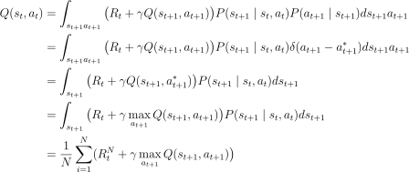
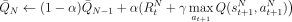

# Reinforcement Learning Summary

# Table of Contents
0. [Return, Value function](#0-return-value-function)
1. [Bellman equation](#1-bellman-equation)
2. [Purpose of RL](#2-purpose-of-rl)
3. [Concept of Value based RL](#3-concept-of-value-based-rl)
4. [Q-Learning](#4-q-learning)
5. [DQN](#5-dqn)
6. [Concept of Policy based RL](#6-concept-of-policy-based-rl)
7. [REINFORCE](#7-reinforce)
8. [Actor Critic](#8-actor-critic)
9. [A2C](#9-a2c)

## 0. Return, Value function
- Return
    - $G_t=R_t+\gamma R_{t+1}+\gamma ^2R_{t+2}+\dots $
- Expected return
    - $E[G_t]=\int_x G_tP(x)dx $
- State Value Function
    - $V(s_t)≜\int_{a_t:a_\infty}G_tP(a_t,s_{t+1},a_{t+1},\dots \mid s_t)da_t:a_\infty $
- Action State Value Function
    - $Q(s_t, a_t)≜\int_{s_{t+1}:a_\infty}G_tP(s_{t+1},a_{t+1},s_{t+2}\dots \mid s_t,a_t)ds_{t+1}:a_\infty $

## 1. Bellman equation
- State Value Function $\quad V \rightarrow Q$
    $$
    \begin{align*}
    V(s_t) &\triangleq \int_{a_t:a_\infty}G_tP(a_t,s_{t+1},a_{t+1},\dots \mid s_t)da_t:a_\infty \\
    &=\int_{a_t}\int_{s_{t+1}:a_\infty}G_tP(s_{t+1},a_{t+1},\dots \mid s_t,a_t)ds_{t+1}:a_\infty P(a_t \mid s_t)da_t \\
    &=\int_{a_t}Q(s_t,a_t) P(a_t \mid s_t)da_t
    \end{align*}
    $$

- State Value Function $\quad V(s_t) \rightarrow v(s_{t+1})$
    $$
    \begin{align*}
    V(s_t) &\triangleq \int_{a_t:a_\infty}G_tP(a_t,s_{t+1},a_{t+1},\dots \mid s_t)da_t:a_\infty \\
    &=\int_{a_t:s_{t+1}}\int_{a_{t+1}:a_\infty}(R_t+\gamma G_{t+1})P(a_{t+1},\dots \mid s_t,a_t,s_{t+1})da_{t+1}:a_\infty P(a_t,s_{t+1} \mid s_t)da_t:s_{t+1} \\
    &=\int_{a_t:s_{t+1}}(R_t+\gamma V(s_{t+1}))P(a_ts_{t+1} \mid s_t)da_t:s_{t+1}
    \end{align*}
    $$

- Action State Value Function $\quad Q \rightarrow V$
    $$
    \begin{align*}
    Q(s_t, a_t) &\triangleq \int_{s_{t+1}:a_\infty}G_t P(s_{t+1},a_{t+1},s_{t+2}\dots \mid s_t,a_t) ds_{t+1}:a_\infty \\
    &= \int_{s_{t+1}} \int_{a_{t+1}:a_\infty} \big( R_t + \gamma G_{t+1} \big) P(a_{t+1} s_{t+2} \dots \mid s_t, a_t, s_{t+1}) da_{t+1}:a_\infty P(s_{t+1} \mid s_t, a_t) ds_{t+1} \\
    &= \int_{s_{t+1}} \big( R_t + V(s_{t+1}) \big) P(s_{t+1} \mid s_t, a_t) ds_{t+1} 
    \end{align*}
    $$
    

- Action State Value Function $\quad Q(s_t,a_t) \rightarrow Q(s_{t+1},a_{t+1})$
    $$
    \begin{align*}
    Q(s_t, a_t) &\triangleq \int_{s_{t+1}:a_\infty}G_t P(s_{t+1},a_{t+1},s_{t+2}\dots \mid s_t,a_t) ds_{t+1}:a_\infty \\
    &= \int_{s_{t+1} a_{t+1}} \int_{s_{t+2}:a_\infty} \big( R_t + \gamma G_{t+1} \big) P(s_{t+2} \dots \mid s_t, a_t, s_{t+1}, a_{t+1}) ds_{t+2}:a_\infty P(s_{t+1}, a_{t+1} \mid s_t, a_t) ds_{t+1} a_{t+1} \\
    &= \int_{s_{t+1} a_{t+1}} \big( R_t + \gamma Q(s_{t+1}, a_{t+1}) \big) P(s_{t+1}, a_{t+1} \mid s_t, a_t) ds_{t+1} da_{t+1} \\
    &= \int_{s_{t+1} a_{t+1}} \big( R_t + \gamma Q(s_{t+1}, a_{t+1}) \big) P(s_{t+1} \mid s_t, a_t) P(a_{t+1} \mid s_{t+1}) ds_{t+1} a_{t+1}
    \end{align*}
    $$

## 2. Purpose of RL
- optimal policy $Q^*$
    - $a_{t}^* \triangleq \underset{a_t}{\mathrm{argmax}} Q^*(s_t,a_t)$
- maximize expected return $V(s_t)$
    $$
    \begin{align*}
    \mathrm{argmax} V(s_t) &= \mathrm{argmax} \int_{a_t} Q(s_t,a_t) P(a_t \mid s_t)da_t \\
    &= \mathrm{argmax} \int_{a_t}Q^*(s_t,a_t) P(a_t \mid s_t)da_t
    \end{align*}
    $$

## 3. Concept of Value based RL
- Suppose policy as Dirac delta function
    - $P^* (a_t \mid s_t) = \delta (a_t - a_t^*)$
- Then how can we get $Q^*$?
- Monte Carlo (MC)
    $$
    \begin{align*}
    Q(s_t, a_t) \approx \frac{1}{N} \sum_{i=1}^NG_t^{(i)}
    \end{align*}
    $$
    - Update every episode.
    - Unbiased, higher variance.
- Temporal Difference (TD)
    $$
    \begin{align*}
    Q(s_t, a_t) &\approx \frac{1}{N} \sum_{i=1}^N (R_t^N + \gamma Q(s_{t+1}^N, a_{t+1}^N)) \triangleq \bar{Q}_{N} \\
    &= \frac{1}{N} ((N-1) \bar{Q}_{N-1} + R_t^N + \gamma Q(s_{t+1}^N, a_{t+1}^N)) \\
    &= \bar{Q}_{N-1} + \frac{1}{N} (R_t^N+ \gamma Q(s_{t+1}^N, a_{t+1}^N) - \bar{Q}_{N-1}) \\
    \therefore \bar{Q}_{N} &= (1- \alpha ) \bar{Q}_{N-1} + \alpha (R_t^N + \gamma Q(s_{t+1}^N, a_{t+1}^N)) \\
    \end{align*}
    $$

    - learning rate $=\alpha$
    - TD Error $= R_t^N+\gamma Q(s_{t+1}^N, a_{t+1}^N) - \bar{Q}_{N-1}$
    - TD Target $= R_t^N+\gamma Q(s_{t+1}^N, a_{t+1}^N)$
    - Update every step.
    - Biased, lower variance.

## 4. Q-Learning
- Target: $P(a_{t+1} \mid s_{t+1}) = \delta(a_{t+1} - a_{t+1}^*) $
- Behavior: $\epsilon$-greedy

  
<!-- 
$$
\begin{align*}
Q(s_t, a_t) &= \int_{s_{t+1} a_{t+1}} \big( R_t + \gamma Q(s_{t+1}, a_{t+1}) \big) P(s_{t+1} \mid s_t, a_t) P(a_{t+1} \mid s_{t+1}) ds_{t+1} a_{t+1} \\
&= \int_{s_{t+1} a_{t+1}} \big( R_t + \gamma Q(s_{t+1}, a_{t+1}) \big) P(s_{t+1} \mid s_t, a_t) \delta(a_{t+1} - a_{t+1}^*) ds_{t+1} a_{t+1} \\
&= \int_{s_{t+1}} \big( R_t + \gamma Q(s_{t+1}, a_{t+1}^*) \big) P(s_{t+1} \mid s_t, a_t) ds_{t+1} \\
&= \int_{s_{t+1}} \big( R_t + \gamma \max _{a_{t+1}} Q(s_{t+1}, a_{t+1}) \big) P(s_{t+1} \mid s_t, a_t) ds_{t+1} \\
&= \frac{1}{N}\sum_{i=1}^N ( R_t^N + \gamma \max _{a_{t+1}} Q(s_{t+1}, a_{t+1}) \big)
\end{align*}
$$
 -->

- Update

  
  
<!-- 
$$
\begin{align*}
\bar{Q}_{N} \leftarrow (1- \alpha ) \bar{Q}_{N-1} + \alpha (R_t^N + \gamma \max _{a_{t+1}} Q(s_{t+1}^N, a_{t+1}^N) \big )
\end{align*}
$$
-->
  

## 5. DQN
- The Q value reflects more states through regression (Neural Network).
- The number of outputs generated is the number of possible combinations of actions.
- Features:
    1. Using neural network (CNN to act like humans)
    2. Use Experience replay.
        - Use mini batch
        - If you learn using states that are too similar, regression problems may occur. Therefore, random selection and learning are performed by combining past data.
    3. Seperate target, main network
        - During regression, prevent the target network from ossilating.
## 6. Concept of Policy based RL
## 7. REINFORCE
## 8. Actor Critic
## 9. A2C
## 0. etc

  
  

  

