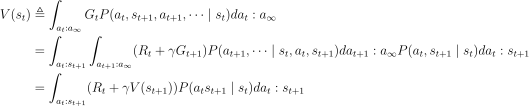
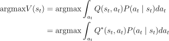
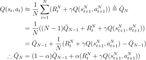
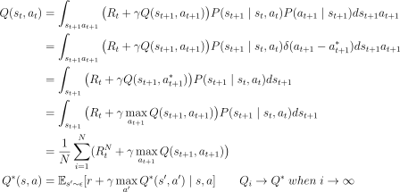
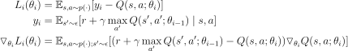

# Reinforcement Learning Summary

# Table of Contents
0. [Return, Value function](#0-return-value-function)
1. [Bellman equation](#1-bellman-equation)
2. [Purpose of RL](#2-purpose-of-rl)
3. [Concept of Value based RL](#3-concept-of-value-based-rl)
4. [Q-Learning](#4-q-learning)
5. [DQN](#5-dqn)
6. [Concept of Policy based RL](#6-concept-of-policy-based-rl)
7. [REINFORCE](#7-reinforce)
8. [Actor Critic](#8-actor-critic)
9. [A2C](#9-a2c)

## 0. Return, Value function
- Return
    - $G_t=R_t+\gamma R_{t+1}+\gamma ^2R_{t+2}+\dots $
- Expected return
    - $E[G_t]=\int_x G_tP(x)dx $
- State Value Function
    - $V(s_t)≜\int_{a_t:a_\infty}G_tP(a_t,s_{t+1},a_{t+1},\dots \mid s_t)da_t:a_\infty $
- Action State Value Function
    - $Q(s_t, a_t)≜\int_{s_{t+1}:a_\infty}G_tP(s_{t+1},a_{t+1},s_{t+2}\dots \mid s_t,a_t)ds_{t+1}:a_\infty $

 <a href="#top" target="_blank">table of contents</a> 

## 1. Bellman equation
- State Value Function $\quad V \rightarrow Q$

    

<!--
$$
\begin{align*}
V(s_t) &\triangleq \int_{a_t:a_\infty}G_tP(a_t,s_{t+1},a_{t+1},\dots \mid s_t)da_t:a_\infty \\
&=\int_{a_t}\int_{s_{t+1}:a_\infty}G_tP(s_{t+1},a_{t+1},\dots \mid s_t,a_t)ds_{t+1}:a_\infty P(a_t \mid s_t)da_t \\
&=\int_{a_t}Q(s_t,a_t) P(a_t \mid s_t)da_t
\end{align*}
$$ 
-->

- State Value Function $\quad V(s_t) \rightarrow v(s_{t+1})$

    

<!-- 
$$
\begin{align*}
V(s_t) &\triangleq \int_{a_t:a_\infty}G_tP(a_t,s_{t+1},a_{t+1},\dots \mid s_t)da_t:a_\infty \\
&=\int_{a_t:s_{t+1}}\int_{a_{t+1}:a_\infty}(R_t+\gamma G_{t+1})P(a_{t+1},\dots \mid s_t,a_t,s_{t+1})da_{t+1}:a_\infty P(a_t,s_{t+1} \mid s_t)da_t:s_{t+1} \\
&=\int_{a_t:s_{t+1}}(R_t+\gamma V(s_{t+1}))P(a_ts_{t+1} \mid s_t)da_t:s_{t+1}
\end{align*}
$$
 -->

- Action State Value Function $\quad Q \rightarrow V$

    

<!-- 
$$
\begin{align*}
Q(s_t, a_t) &\triangleq \int_{s_{t+1}:a_\infty}G_t P(s_{t+1},a_{t+1},s_{t+2}\dots \mid s_t,a_t) ds_{t+1}:a_\infty \\
&= \int_{s_{t+1}} \int_{a_{t+1}:a_\infty} \big( R_t + \gamma G_{t+1} \big) P(a_{t+1} s_{t+2} \dots \mid s_t, a_t, s_{t+1}) da_{t+1}:a_\infty P(s_{t+1} \mid s_t, a_t) ds_{t+1} \\
&= \int_{s_{t+1}} \big( R_t + V(s_{t+1}) \big) P(s_{t+1} \mid s_t, a_t) ds_{t+1} 
\end{align*}
$$
 -->
    

- Action State Value Function $\quad Q(s_t,a_t) \rightarrow Q(s_{t+1},a_{t+1})$

    

<!--
$$
\begin{align*}
Q(s_t, a_t) &\triangleq \int_{s_{t+1}:a_\infty}G_t P(s_{t+1},a_{t+1},s_{t+2}\dots \mid s_t,a_t) ds_{t+1}:a_\infty \\
&= \int_{s_{t+1} a_{t+1}} \int_{s_{t+2}:a_\infty} \big( R_t + \gamma G_{t+1} \big) P(s_{t+2} \dots \mid s_t, a_t, s_{t+1}, a_{t+1}) ds_{t+2}:a_\infty P(s_{t+1}, a_{t+1} \mid s_t, a_t) ds_{t+1} a_{t+1} \\
&= \int_{s_{t+1} a_{t+1}} \big( R_t + \gamma Q(s_{t+1}, a_{t+1}) \big) P(s_{t+1}, a_{t+1} \mid s_t, a_t) ds_{t+1} da_{t+1} \\
&= \int_{s_{t+1} a_{t+1}} \big( R_t + \gamma Q(s_{t+1}, a_{t+1}) \big) P(s_{t+1} \mid s_t, a_t) P(a_{t+1} \mid s_{t+1}) ds_{t+1} a_{t+1}
\end{align*}
$$
-->

 <a href="#top" target="_blank">table of contents</a> 

## 2. Purpose of RL
- optimal policy $Q^*$
    - $Q^*(s_t,a_t)=\underset{\pi}{\mathrm{max}}\mathbb{E}[r_t + \gamma^{} r_{t+1} + \gamma^{2} r_{t+2} + \dots \mid s_t, a_t, \pi]$
    - $a_{t}^* \triangleq \underset{a_t}{\mathrm{argmax}} Q^*(s_t,a_t)$
- maximize expected return $V(s_t)$

    

<!--
$$
\begin{align*}
\mathrm{argmax} V(s_t) &= \mathrm{argmax} \int_{a_t} Q(s_t,a_t) P(a_t \mid s_t)da_t \\
&= \mathrm{argmax} \int_{a_t}Q^*(s_t,a_t) P(a_t \mid s_t)da_t
\end{align*}
$$
-->

 <a href="#top" target="_blank">table of contents</a> 

## 3. Concept of Value based RL
- Suppose policy as Dirac delta function
    - $P^* (a_t \mid s_t) = \delta (a_t - a_t^*)$
- Then how can we get $Q^*$?
- Monte Carlo (MC)
    - Update every episode.
    - Unbiased, higher variance.

    

<!--
$$
\begin{align*}
Q(s_t, a_t) \approx \frac{1}{N} \sum_{i=1}^NG_t^{(i)}
\end{align*}
$$
-->

- Temporal Difference (TD)
    - learning rate $=\alpha$
    - TD Error $= R_t^N+\gamma Q(s_{t+1}^N, a_{t+1}^N) - \bar{Q}_{N-1}$
    - TD Target $= R_t^N+\gamma Q(s_{t+1}^N, a_{t+1}^N)$
    - Update every step.
    - Biased, lower variance.

    

<!-- 
$$
\begin{align*}
Q(s_t, a_t) &\approx \frac{1}{N} \sum_{i=1}^N (R_t^N + \gamma Q(s_{t+1}^N, a_{t+1}^N)) \triangleq \bar{Q}_{N} \\
&= \frac{1}{N} ((N-1) \bar{Q}_{N-1} + R_t^N + \gamma Q(s_{t+1}^N, a_{t+1}^N)) \\
&= \bar{Q}_{N-1} + \frac{1}{N} (R_t^N+ \gamma Q(s_{t+1}^N, a_{t+1}^N) - \bar{Q}_{N-1}) \\
\therefore \bar{Q}_{N} &= (1- \alpha ) \bar{Q}_{N-1} + \alpha (R_t^N + \gamma Q(s_{t+1}^N, a_{t+1}^N)) \\
\end{align*}
$$
-->

 <a href="#top" target="_blank">table of contents</a> 

## 4. Q-Learning
- Target: $P(a_{t+1} \mid s_{t+1}) = \delta(a_{t+1} - a_{t+1}^*) $
- Behavior: $\epsilon$-greedy

    

<!-- 
$$
\begin{align*}
Q(s_t, a_t) &= \int_{s_{t+1} a_{t+1}} \big( R_t + \gamma Q(s_{t+1}, a_{t+1}) \big) P(s_{t+1} \mid s_t, a_t) P(a_{t+1} \mid s_{t+1}) ds_{t+1} a_{t+1} \\
&= \int_{s_{t+1} a_{t+1}} \big( R_t + \gamma Q(s_{t+1}, a_{t+1}) \big) P(s_{t+1} \mid s_t, a_t) \delta(a_{t+1} - a_{t+1}^*) ds_{t+1} a_{t+1} \\
&= \int_{s_{t+1}} \big( R_t + \gamma Q(s_{t+1}, a_{t+1}^*) \big) P(s_{t+1} \mid s_t, a_t) ds_{t+1} \\
&= \int_{s_{t+1}} \big( R_t + \gamma \max _{a_{t+1}} Q(s_{t+1}, a_{t+1}) \big) P(s_{t+1} \mid s_t, a_t) ds_{t+1} \\
&= \frac{1}{N}\sum_{i=1}^N ( R_t^N + \gamma \max _{a_{t+1}} Q(s_{t+1}, a_{t+1}) \big) \\
Q^*(s, a) &= \mathbb{E}_{s' \sim \epsilon } [r + \gamma \max _{a'} Q^*(s', a') \mid s, a] \qquad Q_i \rightarrow Q^*  \ when \ i \rightarrow \infty \\
\end{align*}
$$
 -->

- Update

    

<!-- 
$$
\begin{align*}
\bar{Q}_{N} \leftarrow (1- \alpha ) \bar{Q}_{N-1} + \alpha (R_t^N + \gamma \max _{a_{t+1}} Q(s_{t+1}^N, a_{t+1}^N) \big )
\end{align*}
$$
-->

 <a href="#top" target="_blank">table of contents</a> 

## 5. DQN
- The Q value reflects more states through regression (Neural Network).
- The number of outputs generated is the number of possible combinations of actions.
- Features:
    1. Using neural network (Q-Network) (CNN to act like humans)
    2. Use Experience replay.
        - Use mini batch
        - If you learn using states that are too similar, regression problems may occur. Therefore, random selection and learning are performed by combining past data.
    3. Seperate target, main network
        - During regression, prevent the target network from ossilating.
- Action State Value $Q$ is same as Q-Learing:
- Loss function $L_i(\theta _i)$ of Q-Network:

  

<!--
$$
\begin{align*}
L_i(\theta _i) &=  \mathbb{E}_{s,a \sim p(\cdot) } [y_i - Q(s , a ; \theta _i)] \\
y_i &= \mathbb{E}_{s' \sim \epsilon } [r + \gamma \max _{a'} Q(s', a' ; \theta _{i-1}) \mid s, a] \\
{\triangledown}_{\theta _i} L_i(\theta _i) &= \mathbb{E}_{s,a \sim p(\cdot) ; s' \sim \epsilon} [(r + \gamma \max _{a'} Q(s', a' ; \theta _{i-1})-Q(s,a;\theta_i)){\triangledown}_{\theta _i} Q(s , a ; \theta_i )] \\
\end{align*}
$$
-->

 <a href="#top" target="_blank">table of contents</a> 

## 6. Concept of Policy based RL
- Get policy as PDF
    - $P^* (a_t \mid s_t) = PDF$
- Strengths in continuous action.
- Can create stochastic policies.
- Object function $J$ 
    - Purpose of object function is maximize expected return G
    - Trajectory: $\tau = {s_0, a_0, s_1, \dots}$

  

<!--
$$
\begin{align*}
J &\triangleq \mathbb{E}[G_0] \\
&=\int_\tau G_0 \ P(\tau) \ d\tau \\
J_\theta&=\int_\tau G_0 \ P_\theta(\tau) \ d\tau \\
\end{align*}
$$
 -->

- Possibility can devided into transision and policy

  

<!--
$$
\begin{align*}
{P_\theta(\tau)} &= {P_\theta(s_0, a_0, s_1, \dots)} \\
&= P(s_0)P_\theta(a_0, s_1, \dots \mid s_0) \\
&= P(s_0)P_\theta(a_0 \mid s_0)P_\theta(a_0, s_1, \dots \mid s_0, a_0) \\
&= P(s_0)P_\theta(a_0 \mid s_0)P(s_1 \mid s_0,a_0) P_\theta(a_ 1\mid s_0,a_0,s_1) \dots \\
&= P(s_0)P_\theta(a_0 \mid s_0)P(s_1 \mid s_0,a_0) P_\theta(a_ 1\mid s_0) \dots \\
&= transision \times policy \times transision \times policy \times \dots \\
{\triangledown}_{\theta} \ln{P_\theta(\tau)} &= \sum_{t=0}^{\infty}{{\triangledown}_{\theta} \ln{P_\theta (a_t \mid s_t)} }\\
\end{align*}
$$
-->

- When i > k,

  

<!--
$$
\begin{align*}
P_\theta(\tau) &= P_\theta(a_i \mid \tau_{-a_i})P(\tau_{-a_i}) \\
&= P_\theta(a_i \mid s_i)P(\tau_{-a_i}) \\
\int_\tau R_k {\triangledown}_{\theta} \ln{P_\theta (a_i \mid s_i)} \ P_\theta(\tau)d\tau &= \int_\tau R_k {\triangledown}_{\theta} \ln{P_\theta (a_i \mid s_i)} \ P_\theta(a_i \mid s_i)P(\tau_{-a_i}) d\tau \\
&= \int_{\tau_{-a_i}} R_k \int_{a_i} {\triangledown}_{\theta} \ln{P_\theta (a_i \mid s_i)} \ P_\theta(a_i \mid s_i)da_i P(\tau_{-a_i})d\tau_{-a_i} \\
&= \int_{\tau_{-a_i}} R_k \int_{a_i} {\triangledown}_{\theta} P_\theta(a_i \mid s_i)da_i P(\tau_{-a_i})d\tau_{-a_i} \\
&= \int_{\tau_{-a_i}} R_k {\triangledown}_{\theta} \int_{a_i} P_\theta(a_i \mid s_i)da_i P(\tau_{-a_i})d\tau_{-a_i} \\
&= \int_{\tau_{-a_i}} R_k {\triangledown}_{\theta} P(\tau_{-a_i})d\tau_{-a_i} \\
&= 0 \\
\end{align*}
$$
-->

- use policy gradient ${\triangledown}_{\theta} J_\theta$ to update network

  

<!--  
$$
\begin{align*}
\theta \leftarrow \theta + \alpha{\triangledown}_{\theta} J_\theta
\end{align*}
$$
-->

  

<!--
$$
\begin{align*}
{\triangledown}_{\theta} J_\theta &\triangleq \frac{\partial J_\theta}{\partial \theta} \\
&={\triangledown}_{\theta}\int_\tau G_0 \ P_\theta(\tau)d\tau \\
&=\int_\tau G_0 \ {\triangledown}_{\theta} \ P_\theta(\tau)d\tau \\
&=\int_\tau G_0 \ {\triangledown}_{\theta} \ \ln{P_\theta(\tau)} \ P_\theta(\tau)d\tau \\
&=\int_\tau (R_0 + \gamma R_1 + \gamma^2 R_2 \dots) \ ({\triangledown}_{\theta} \ln{P_\theta (a_0 \mid s_0)} + {\triangledown}_{\theta} \ln{P_\theta (a_1 \mid s_1)}+\dots) \ P_\theta(\tau)d\tau \\
&=\int_\tau \sum_{t=0}^{\infty} \ ({\triangledown}_{\theta} \ln{P_\theta (a_t \mid s_t)} \times (\sum_{k=t}^{\infty}{\gamma ^k R_k}) ) \ P_\theta(\tau)d\tau \\
&=\int_\tau \sum_{t=0}^{\infty} \ ({\triangledown}_{\theta} \ln{P_\theta (a_t \mid s_t)} \times (\sum_{k=t}^{\infty}{\gamma ^t \gamma ^{k-t} R_k}) ) \ P_\theta(\tau)d\tau \\
&=\int_\tau \sum_{t=0}^{\infty} \ ({\triangledown}_{\theta} \ln{P_\theta (a_t \mid s_t)} \times ({\gamma ^t G_t}) ) \ P_\theta(\tau)d\tau \\
&\approx \int_\tau \sum_{t=0}^{\infty} \ ({\triangledown}_{\theta} \ln{P_\theta (a_t \mid s_t)} \times G_t ) \ P_\theta(\tau)d\tau \\
\end{align*}
$$
-->

- when $t \rightarrow \infty , {\gamma ^t G_t} \approx {G_t}$

 <a href="#top" target="_blank">table of contents</a> 

## 7. REINFORCE
- Policy gradient ${\triangledown}_{\theta} J_\theta$. Suppose N as 1

  

<!--
$$
\begin{align*}
{\triangledown}_{\theta} J_\theta &\approx \int_\tau \sum_{t=0}^{\infty} \ ({\triangledown}_{\theta} \ln{P_\theta (a_t \mid s_t)} \ G_t ) \ P_\theta(\tau)d\tau \\
&\approx \frac{1}{N}\sum_{}^{N} \sum_{t=0}^{\infty} \ ({\triangledown}_{\theta} \ln{P_\theta (a_t \mid s_t)} \ G_t ) \\
&\approx \sum_{t=0}^{\infty} \ ({\triangledown}_{\theta} \ln{P_\theta (a_t \mid s_t)} \ G_t ) \\
\end{align*}
$$
-->

- Update
    - You can only update once an episode is finished because you can get $G_t$ only after the episode is finished.

  

<!--
$$
\begin{align*}
\theta &\leftarrow \theta + \alpha {\triangledown}_{\theta} J_\theta\\
&\leftarrow \theta + \alpha \sum_{t=0}^{\infty} \ {\triangledown}_{\theta} \ln{P_\theta (a_t \mid s_t)} \ G_t \\
\end{align*}
$$
-->
- Unbiased, but high variance because all paths and possibilities have to be experienced.

 <a href="#top" target="_blank">table of contents</a> 

## 8. Actor Critic
## 9. A2C
## 0. etc

<!--

  

-->